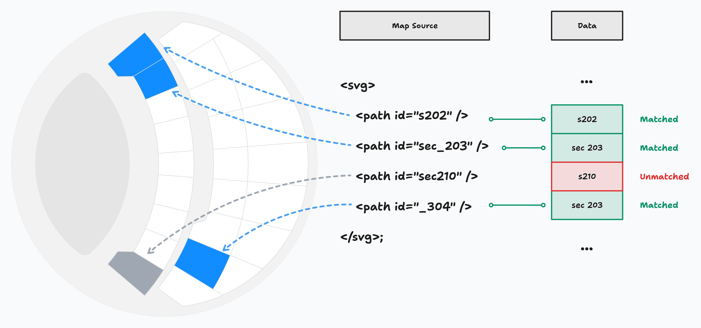

In Synoptic Panel, data binding is the process of linking Power BI data to the visual elements (shapes or groups of shapes) of an SVG image, called a map ([what is a map?](./maps/index)). This allows any image to be transformed into a dynamic, interactive visualization.

<todo>Screencast of map interactivity</todo>

## Map Areas

To understand how data binding works, it is important to understand the concept of areas. An area is a shape or a group of shapes of an SVG image that has a unique identifier (`id`). Without this identifier (and if no manual binding has been set up - [see below](#manual-binding)), elements are considered as decorations and cannot be interacted with. 

```svg
<svg>
    <!-- This is an "area" -->
    <path id="area1" d="M10 10"/>

    <!-- This is a decorative element -->
    <circle cx="10" cy="10" r="2"/>
</svg>
```

The example above shows the source code of an SVG image: in fact, Synoptic Panel only accepts maps in SVG format, which is a text-based format similar to HTML and can be edited with any text editor. Thus, it is easy to add or change the identifier of any element in a map. 

> There are some rules and conventions that govern the assignment of the identifier and which are the elements that can be promoted as areas. For more information, see [SVG Format](./maps/svg-format#id-attribute).

However, it is not recommended to make this editing manually, as it can lead to errors. Instead, you can use graphic editors such as *Adobe Illustrator* or *Inkscape* to do this job. It's also possible to use Synoptic Panel's Map Editor ([see below](#manual-binding)) to bind elements to data points, bypassing the need to assign identifiers.


## Linking Areas to Data 

Each area of a map can be linked to a specific data point ([what is a data point?](../../glossary.md#data-point)) of the columns bound to the ***Categories*** field well. This can be done automatically or manually.

### Automatic Binding 

Automatic binding takes place when the `id` of a map area matches one of the values of the ***Categories*** column. If the match is successful, the area status is set to **"Matched"**, is internally linked to the matched data point, and becomes interactive and customizable by the user. If the match is not successful, the area status is set as **"Unmatched"**.

Matching is done according to the following rules:

- Characters are compared case-insensitively.
- Leading and trailing spaces are ignored.
- The first character is ignored if it is an underscore (`_`) followed by a number.
- Special characters escaped with `_xHH_` are decoded, where *HH* is the hexadecimal representation of the character code
(e.g., *"_x24_"* is decoded as **$**).

<figure>
    
    <figcaption>
        In this example, the paths with the id "s202", "sec_203", and "_304" match the data points "s202", "sec 203", and "304", respectively, while the path with "sec210" does not match any data point.
    </figcaption>
</figure>

#### Automatic Binding when Hierarchy is Expanded

<todo visible>How automatic binding works when the hierarchy is expanded explanation.</todo>

### Manual Binding

When automatic binding is not possible or not desired, you can manually bind areas to data points. This can be done through Synoptic Panel's Map Editor, which allows you to select each map element and link it to a specific value of the ***Categories*** column. When this is done, the status of the target area is set to **"Strong Matched"**, and it takes precedence over automatic binding.

<todo>Screenshot of the Map Editor</todo>

> Keep in mind that in the Map Editor you can select the data point to be associated with an area **from those available at the time of editing**. This means that if a filter is applied, you may not see all the data points available in the dataset. Remember to remove any filters before opening the Map Editor.

Another way to manually bind areas is to edit the SVG file directly. This is useful, for example, when the column values contain invalid characters as XML ID. In such cases, a `data-okviz-strong` attribute can be added to the SVG element (see more on [SVG Format](./maps/svg-format#custom-attributes)); the value of the attribute must match the data point value according to the same rules as for automatic binding.

<todo>Example of code and screenshot</todo>


#### Linking Multiple Areas to the Same Data Point

It is also possible to link multiple areas to the same data point.

> Note that an SVG group (tag `g`, which is a group of shapes) is considered a single area and is treated as such by Synoptic Panel. This section refers to the case where you have multiple areas that you want to link to the same data point.

Since assigning the same `id` to multiple elements is not allowed by the SVG specification, you can use the `data-okviz-strong` attribute to force the binding of multiple areas to the same data point.

<todo>Example of code and screenshot</todo>


#### Unbinding Areas

If you wish to exclude an area from the data binding process, you can do so directly from the Map Editor or you can add a `data-okviz-unbound` attribute to the SVG element. This will prevent the area from being considered for automatic binding and will be assigned to the status **"Unbound"**.

<todo>Screenshot of unbound areas with a different color</todo>

## Areas Status

Here is a summary of the possible statuses of an area (higher priority has precedence):

|Status          |Priority |Description|
|---             |:---:    |---|
|Unbound         |3        |The area is manually excluded from the data binding.|
|Strong Matched  |2        |The area is manually bound to a data point.|
|Matched         |1        |The area is automatically bound to a data point.|
|Unmatched       |0        |The area is not bound to any data point.|

If an area is a child of a group (`g` tag), it has the same status as the group, unless it is manually set with custom attributes such as `data-okviz-strong` or `data-okviz-unbound`; in this case, the status of the child has precedence.

Elements that are not manually bound and without an `id` attribute or a custom binding attribute are not considered areas and are not interactive.
