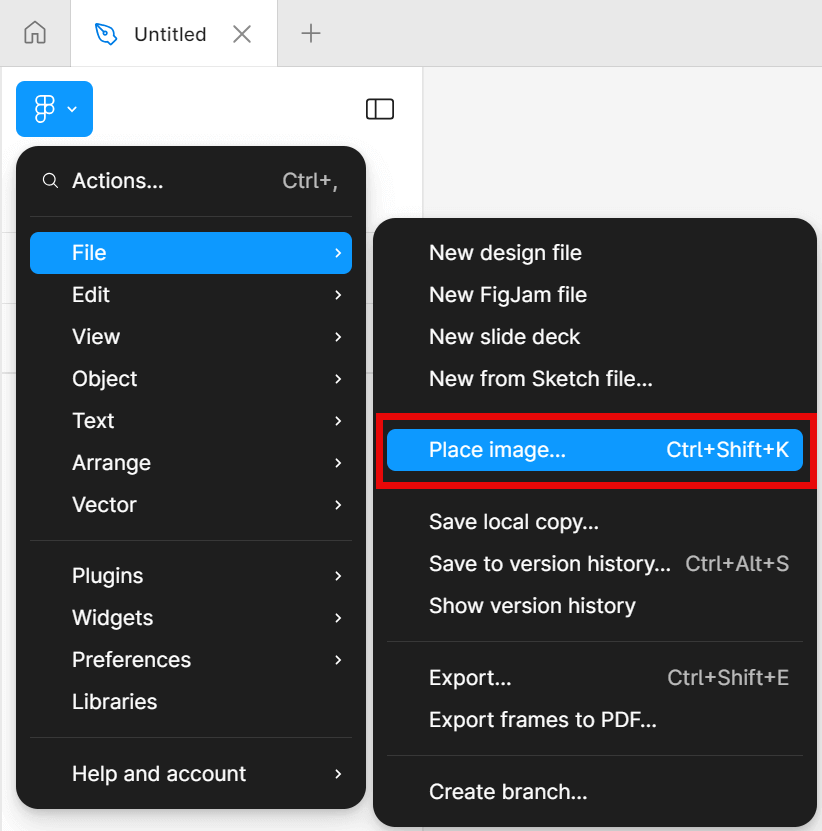
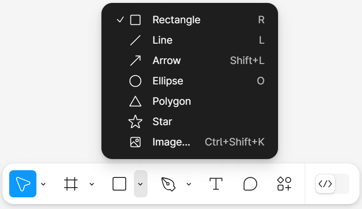
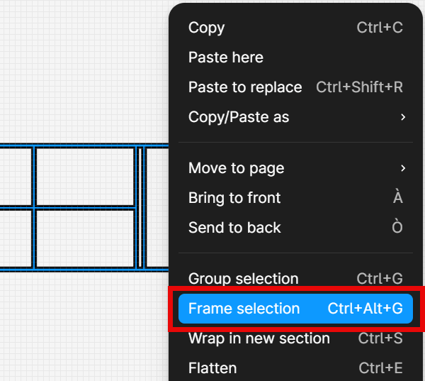
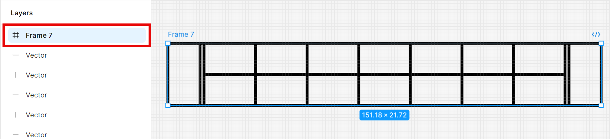
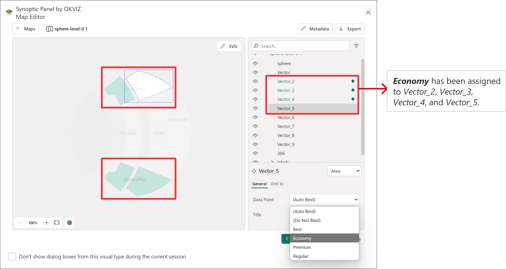
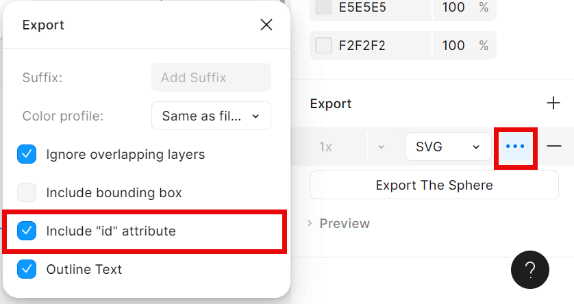

[Figma](https://www.figma.com/) is a versatile, web-based design tool ideal for creating SVG files. This section focuses on using Figma to design SVGs specifically for Synoptic Panel, highlighting the key steps and best practices without covering every feature of the software.

**Figma is free to use** as long as you don’t use enterprise features.

White it's possible to create an entire SVG from scratch, the primary goal of this guide is to use Figma after obtaining the initial image from another source (e.g., AutoCAD, Revit, an image provided by a graphic designer, etc.) to create a file that can be used by Synoptic Panel. 

## Initial Steps

If it’s your first time using Figma, we recommend starting with the [Figma for beginners guide](https://help.figma.com/hc/en-us/sections/4405269443991-Figma-for-beginners-4-parts). The first two parts (Beginner 1 and 2) are particularly useful to get started.

There are two main reasons to use Figma as a complementary tool before importing your map into Synoptic Panel:

- **Drawing overlaying shapes on a bitmap image** (PNG, JPG, etc.)
- **Adjusting or fixing a vector image** (SVG)

### Drawing Overlaying Shapes

A common use case is to import an image and overlay shapes, which can then be used in Synoptic Panel to bind data points from Power BI to these shapes.

To start, import the image by clicking the square icon at the top and selecting ***Place image/video...***.

Once the image is imported, you can begin drawing overlaying shapes on top of it.

> Ensure the order of the elements in the layers is correct. Overlapping elements are displayed from top to bottom in the list, with the topmost element appearing in front. Ensure that the drawn shapes are above the image.

It is crucial that the names of the shapes match the corresponding values in your Power BI dataset. These names will serve as IDs within the SVG file, allowing Synoptic Panel to bind these IDs to the selected Categories field. See more in the [Data Binding](../data-binding) section.

If the shapes require different names, you can manually bind the data points later using the [Map Editor](../../features/map-editor/index.md).

### Adjusting an SVG

Using an SVG file as a starting point instead of a bitmap image can streamline the process of manually creating shapes.
To start, import your SVG file by clicking the square icon at the top and selecting ***Place image/video...***.

SVG files use vectors, and Figma can group these vectors into a frame, which can then be filled.

Assign the correct name to the newly created frame. Upon exporting, the SVG file will contain the ID that Synoptic Panel uses, just like with shapes.

## Grouping

Grouping allows you to link multiple areas to the same data point.

To group shapes, manually select them and choose *Group selection*, or use the shortcut *CTRL+G*.

<video src="images/figma-group.mp4" autoplay loop muted></video>

In the above example, the *Economy* section is divided into four parts. By grouping them, you can associate one data point with the entire group in Synoptic Panel. In this case, the correct name has been given to the group, renaming it *Economy* to match the data in Power BI. Thanks to Synoptic Panel's auto-binding functionality, the data matches correctly without manual intervention.

You can also group shapes directly from the map editor by assigning the same data point to various shapes.

>> Note that Figma does not allow exported SVG files to have repeating ID names, since it follows to XML specifications. Repeating IDs are automatically renamed to ensure the file is valid. This can be a problem when you want to bind multiple areas to the same data point. In this case, you can use a [custom attribute](svg-format.md#custom-attributes) or the [Map Editor](../../features/map-editor/index.md) to bind multiple areas to the same data point.
    

## Exporting
To export all your shapes (and the background image in case you started from a bitmap) as the SVG file that will use Synoptic Panel, first select all the elements and group them as explained above. Then, under export, select SVG.

<video src="images/figma-export-elements.mp4" autoplay loop muted></video>

Before exporting, select the option ***Include “id” attribute***. This ensures that the generated SVG file uses the given names of the shapes as IDs.

Congratulations, now you have an SVG file ready to be used in Synoptic Panel.