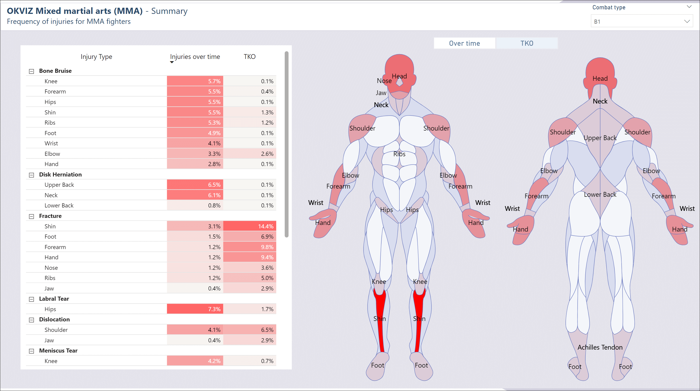
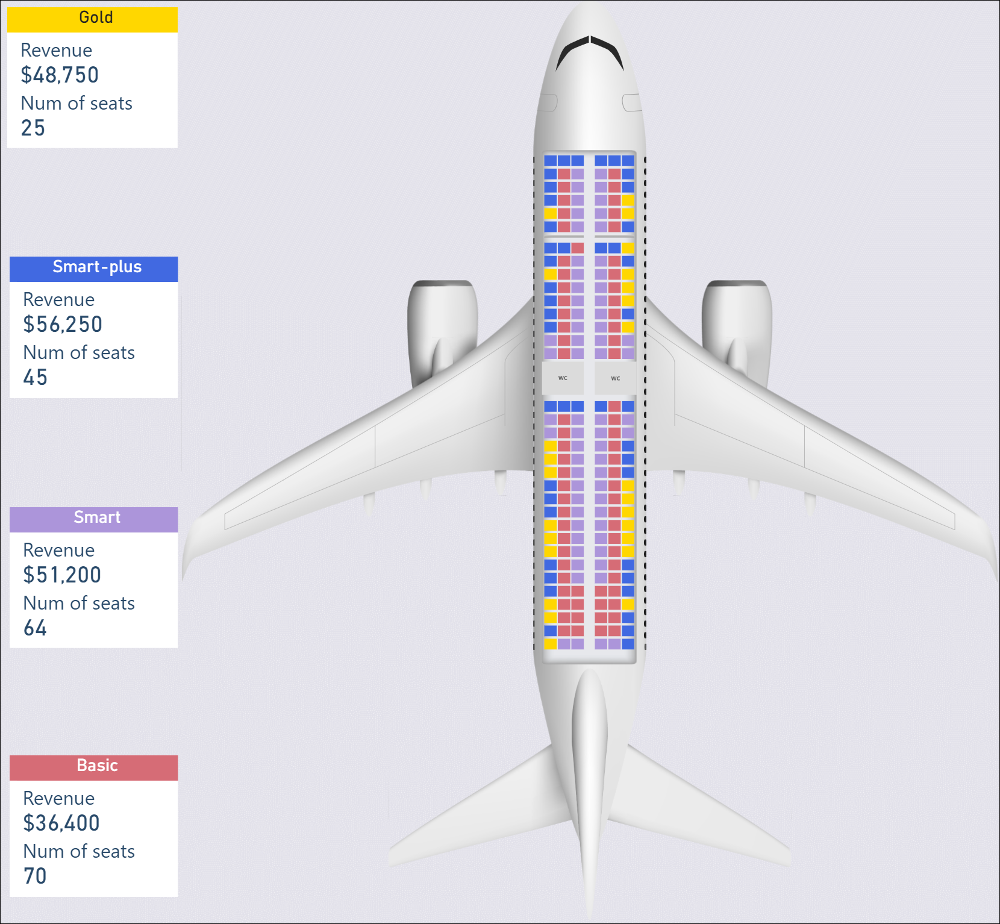
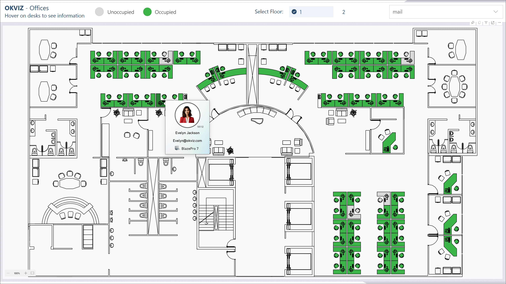
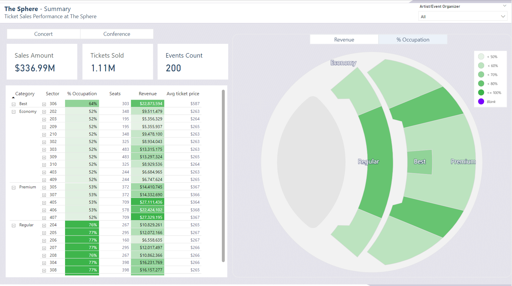

In the context of Synoptic Panel, the term "map" extends beyond traditional geographical boundaries. Here, **a map is any image that can be utilized to visualize and represent data dynamically**. These are not limited to standard maps of regions or countries; they can include a variety of other visual representations such as floor plans, city layouts, machine schematics, anatomical diagrams of the human body, and so on.










Each map consists of distinct shapes or group of elements, each of which can be linked to specific data points. This allows for dynamic data representation within the map, where each area can be highlighted, colored, or labeled in response to the underlying data. 

See more about the [data binding process](../data-binding.md).

## Supported Map Formats

Here are the supported map formats for Synoptic Panel:

### SVG

Synoptic Panel supports and **can only render maps in SVG format**. SVG is a vector image format that provides a flexible and scalable way to represent images. SVG files can be created using various design tools, such as *Adobe Illustrator*, *Inkscape*, or online graphic editors.


For more technical details on this format and the custom attributes supported by Synoptic Panel, see [SVG Format](svg-format.md).

### JSVG

By using Synoptic Panel's [My Storage](../../features/my-storage.md) feature, you may notice that the maps are stored on our servers in a custom format called JSVG (JSON SVG). This format is a JSON representation of the map, which encapsulate the original SVG file and includes the data binding configuration for each area along with additional rendering information.

```json
{
    "id": "_00f561ad-cdca-d2ca-d796-3ade27e72362",
    "name": "map-1",
    "source": "map-1.svg",
    // Metadata
    "meta": {
        "created": "2024-05-24T10:04:28.607Z",
        "updated": "2024-05-24T10:04:28.607Z",
        "size": 13220
    },
    // Data binding configuration
    "dataMapping": {
        "areas": {
            "matched": {},
            "unmatched": {
                "202": {
                    "id": "202",
                    "label": "Sector 202",
                    ...
                },
                ... // More areas
            }
        }
    },
    // Map SVG
    "map": "<svg xmlns=\"http://www.w3.org/2000/svg\">...</svg>", 
    // Elements coordinates
    "mapRects": {
        "sphere": {
            "x": 1325.68,
            "y": 1069.68,
            "width": 5539.62,
            "height": 5539.62
        },
        ... // More rects
    }
}
```

> The JSVG format is used internally by Synoptic Panel. It is not intended to be edited manually, but it can be exported and imported for backup or sharing purposes.

### Other Formats

You can use other image formats as a base for your maps, but you will need to convert them to SVG format before using them. Here are some common approaches to convert images for use in Synoptic Panel:

- **Bitmap images (PNG, JPG, etc.)**  
    You can convert bitmap images by tracing them into vector images through professional design software like *Adobe Illustrator* or *Inkscape*. Note that since this process does not always produce perfect results, it's recommended to use high-quality images with clear boundaries.

    >> It is essential to choose the correct export settings from these tools to ensure the resulting SVG file is suitable for use in Synoptic Panel. See [Creating SVG with a Graphic Editor](creating-svg.md) for more details.

    We also provide a free online tool called [Synoptic Designer](https://synoptic.design/) specifically designed for this use, but please note that it is more of a proof of concept than a full-featured tool.

- **CAD drawings (DXF, DWG, etc.)**  
    You need a CAD software to convert them to SVG, such as *AutoCAD* or *DraftSight*.
    >> Note that due to the complexity of CAD drawings, the conversion process may require manual adjustments to ensure the resulting SVG file is suitable for use in Synoptic Panel. **OKVIZ does not provide support** for this conversion process.

- **Visio diagrams (VSD, VSDX, etc.)**  
    You need *Microsoft Visio* to convert them to SVG. See [Visio Docs](https://support.microsoft.com/en-us/office/save-a-visio-diagram-as-a-graphic-or-image-file-94c892d1-523c-4073-882d-c8ee2ff65d18).

- **GIS data (Shapefile, GeoJSON, etc.)**  
    You need a GIS software to convert them to SVG, such as *QGIS* or *ArcGIS*.

- **Other vector formats (PDF, EPS, AI, etc.)**  
    You need a vector design software to convert them to SVG, such as *Adobe Illustrator*.
