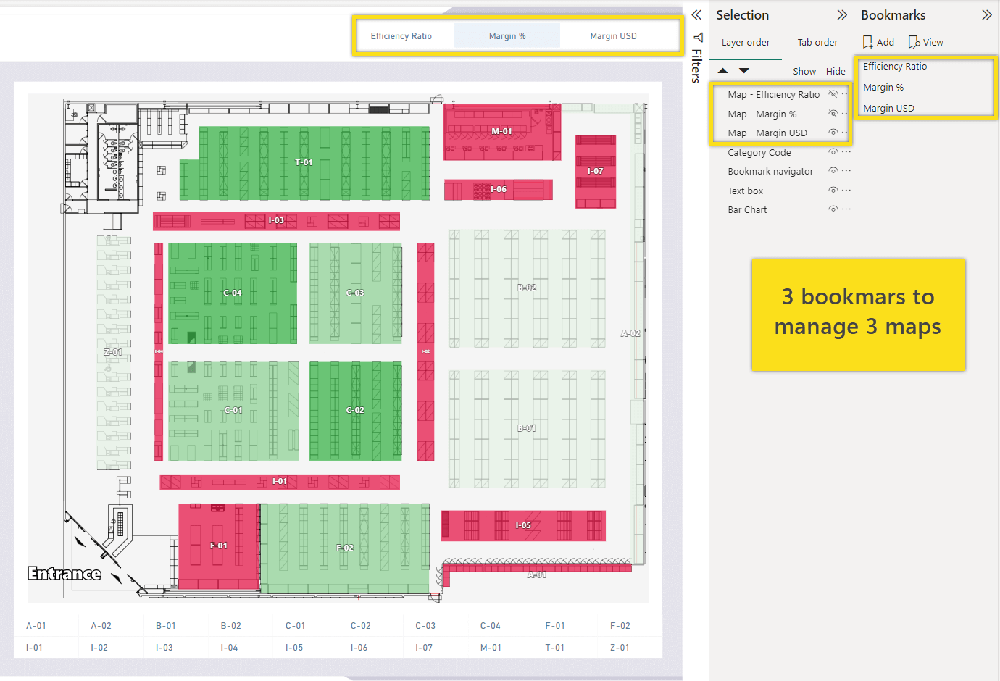
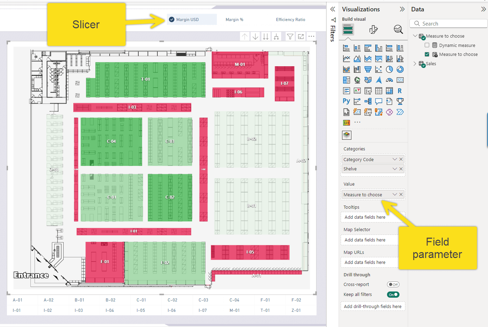
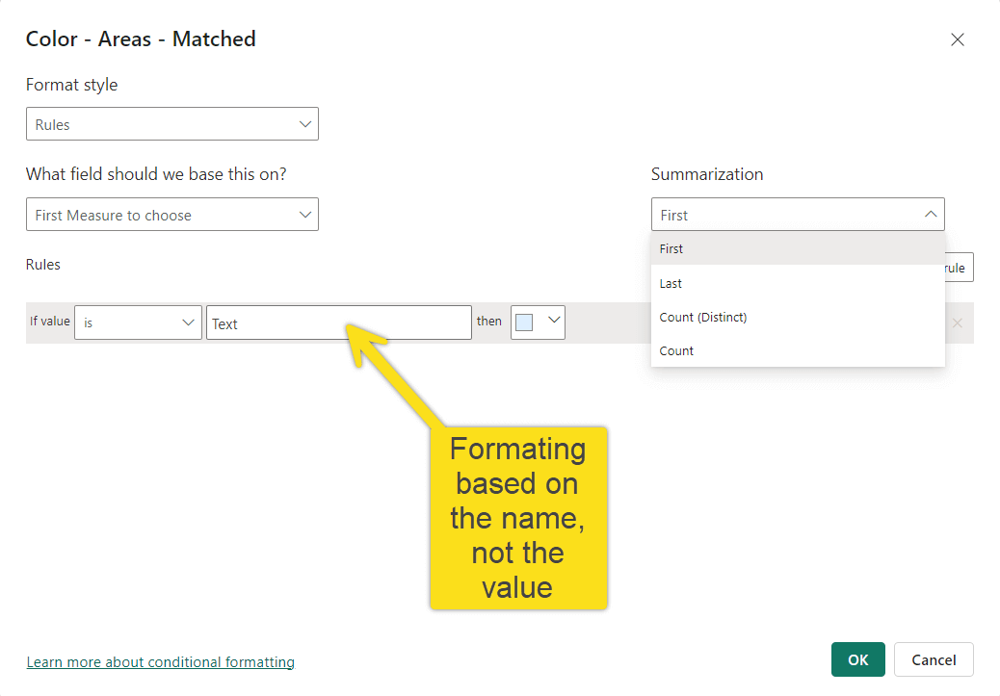
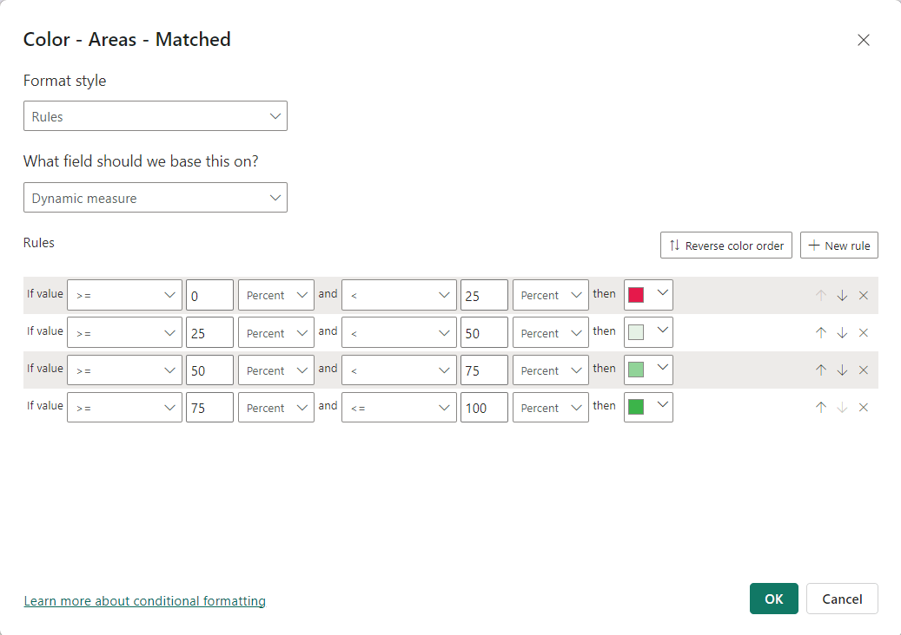
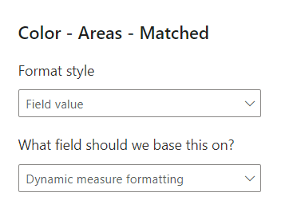

When creating interactive maps in Power BI using the Synoptic Panel, you might want users to switch between different metrics—such as sales, profit margins, or efficiency ratios—without changing the map itself. Achieving this can enhance user experience and simplify report maintenance. 

Below are two methods to accomplish this, along with their advantages and limitations.

## Method 1: Using Bookmarks

One common approach is to utilize [bookmarks](https://learn.microsoft.com/en-us/power-bi/create-reports/desktop-bookmarks?tabs=powerbi-desktop) in Power BI. This method involves creating separate maps for each metric you want to display. For instance, if you have metrics like "Margin USD," "Margin %," and "Efficiency Ratio," you would create a distinct map for each one. You then set up bookmarks to capture the state of each map, including its visual settings and filters.

Users interact with these bookmarks through buttons. When a user selects a metric, the corresponding bookmark is activated, and the map updates to display that metric. This gives the illusion of switching metrics on a single map, although, behind the scenes, different maps are being displayed.

While this method is relatively straightforward to implement for a small number of metrics, it has significant drawbacks. Each new metric requires creating an additional map and bookmark, which increases the maintenance workload. Any changes to the map's design or data require updating each individual map, as there is no synchronization between them. As the number of metrics grows, this approach becomes increasingly cumbersome and time-consuming.



## Method 2: Using Field Parameters

An alternative and more efficient method involves using [Field Parameters](https://learn.microsoft.com/en-us/power-bi/create-reports/power-bi-field-parameters)—a feature in Power BI (currently in preview) that allows you to create a parameter capable of switching between different fields or measures in your data model. This means you can consolidate all the metrics you want to display into a single parameter.

To implement this method, you first create a Field Parameter that includes all the desired metrics. You then integrate this parameter into the Synoptic Panel visual on your report. Users can select the metric they wish to view from a slicer—a simple selection menu—placed on the report page. When a user chooses a metric from the slicer, the map dynamically updates to display data for that metric.

This approach offers several significant advantages. It requires only one map regardless of how many metrics you have, greatly simplifying maintenance. Any updates or changes to the map are automatically applied to all metrics since they all utilize the same visual. Users can effortlessly switch between metrics without the need to load different maps or navigate to different report pages, enhancing the overall user experience.



However, this method presents a challenge with conditional formatting—the ability to change visual elements based on data values. In Power BI, conditional formatting does not natively support Field Parameters because they are treated like text columns. This limitation means you cannot directly apply conditional formatting rules to the Field Parameter in the usual way.



### Overcoming the Conditional Formatting Challenge

To address this limitation, you can set a dynamic measure using DAX to handle the selected metric and apply conditional formatting. This involves creating measures that determine which metric to display and how to format it based on user selection.

You could create a dynamic measure that outputs the value of the selected metric. This measure uses the `SWITCH` function to check which metric is selected from the slicer and returns the corresponding measure.

```dax
Dynamic measure = 
SWITCH(MAX('Measure to choose'[Measure to choose]),
    "Margin USD", [Margin USD],
    "Margin %", [Margin %],
    [Efficiency Ratio]
)
```

In this example, `MAX('Metrics'[SelectedMetric])` retrieves the user's selection from the slicer. The `SWITCH` function compares this selection to the specified cases ("Margin USD," "Margin %," etc.) and returns the appropriate measure.
Now, you can set conditional formatting rules for this newly created `DynamicMeasure`. **However, the formatting rules applied here will be the same for all cases** ("Margin USD," "Margin %," etc.), which may not be ideal if each metric requires different formatting logic.



If your formatting logic varies depending on the selected metric, you can develop a measure that contains the conditional formatting logic specific to each metric. This involves creating a more complex measure that handles all formatting rules in a single place.

Here's how you can do it:

```dax
Dynamic measure formatting = 
VAR _MarginUSDFormatting = IF( [Margin USD] > 1e4, "#3CB44A", "#E6194B")
VAR _MarginPercFormatting = IF( [Margin %]> 0.3, "#3CB44A", "#E6194B")
VAR _EffRatFormatting = IF( [Efficiency Ratio]> 150, "#3CB44A", "#E6194B")
Return
SWITCH(max('Measure to choose'[Measure to choose]),
    "Margin USD", _MarginUSDFormatting,
    "Margin %", _MarginPercFormatting,
    _EffRatFormatting
)
```

In this measure:

- Each `VAR` defines a variable that holds the color code based on a condition specific to that metric.
- The `IF` function checks whether the metric meets a certain threshold and assigns a color accordingly.
- The `RETURN` statement uses a `SWITCH` function to select the appropriate color variable based on the user's metric selection

Finally, you incorporate the `Dynamic measure formatting` measure into the map's conditional formatting settings. This controls the visual appearance based on the metric's value and the specific formatting logic you've defined for each metric.



This setup allows the map to dynamically update both the data and its formatting based on the user's selection from the slicer.

### Benefits of This Approach

This method centralizes all the logic for metric selection and conditional formatting within the measures you have created. It ensures consistency across all metrics and significantly reduces the need for manual adjustments. Since all metrics share the same map visual, any changes to the map's design or settings automatically apply to all metrics. This not only streamlines the development process but also makes the report easier to maintain and scale as new metrics are added.