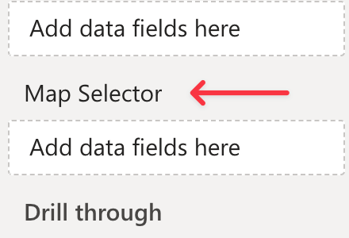
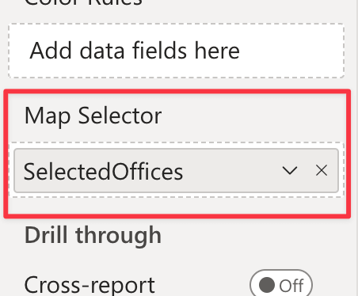

Synoptic Panel allows you to change maps using a report filter or a custom selection. This feature is useful when you want to control the rendered map from a slicer or any other visual in your report.

<todo>Screencast of map filtering</todo>

Synoptic Panel provides different ways to obtain this behavior:

- **Map Selector**: Set a special DAX measure to select the map to display.
- **Map URLs**: Bound a column containing map URLs to display.
- **Single Data Point Maps**: Assign a map to each data point in the data.

It worth mentioning that you can also use the drill mode to programmatically change maps, also if in a different way. When you enable the drill mode, you can assign different maps to each level in the hierarchy. See more in the [Drill Mode](drill-mode.md) section. 

## Map Selector

Synoptic Panel accepts a DAX measure in the **Map Selector** data role.



This measure should return a string consisting in the concatenation of reference values that will be associated to the maps you want to display. Internally, this string is split into individual references, using a [separator character](../options/advanced-options/map-selector.md#separator) as defined in the visual settings.

For each map imported into Synoptic Panel, you can assign one of the references from the map selector using the [Map Editor](map-editor.md), or directly in the JSON file when [importing multiple remote maps](importing.md). 

When the map selector measure returns a reference that matches one of the references assigned to the maps, the visual will display the corresponding map. If the measure returns a reference that doesn't match any of the maps, the visual will display a warning message.

In case of multiple matching maps, the visual will also display the dropdown list to let the user switch between them.

### Selector Measure

The map selector measure must be a DAX expression that returns a string. This string should contain the reference values that will be associated to the maps you want to display.

Assuming you have a table with the following columns and values:

<table>
    <tr><th colspan="3">OfficesTable</th></tr>
    <tr>
        <th>Office</th>
        <th>...</th>
        <th>...</th>
    </tr>
    <tr>
        <td>New York</td>
        <td>...</td>
        <td>...</td>
    </tr>
    <tr>
        <td>Seattle</td>
        <td>...</td>
        <td>...</td>
    </tr>
    <tr>
        <td>Chicago</td>
        <td>...</td>
        <td>...</td>
    </tr>
</table>

The map selector measure must be defined as follows:

```dax
SelectedOffices = 
    CONCATENATEX(
        ALLSELECTED('OfficesTable'[Office]),
        'OfficesTable'[Office],
        "✄" // Separator character
   )
```

In this example, the map selector measure returns a string with the names of the offices currently selected, separated by the character <span style="font-size:20px">✄</span>. 

Change the table and column names according to your dataset.
>> **Important**: The separator character must be the same as the one defined in the visual setting [Map Selector Separator](../options/advanced-options/map-selector.md#separator). 

### Assigning References to Maps

To assign a reference to a map, follow these steps:

1. Create the map selector measure as described above.

2. Bind the measure to the **Map Selector** data role.

    

3. Load a map into Synoptic Panel, if you haven't already.

4. Open the **Map Editor** by clicking the pencil button in the visual toolbar, or by clicking the ***Edit*** button, if you just imported the map.

5. In the Map Editor, choose the reference value that will be associated with the map from the dropdown list in the **Map Selector** section.
    

6. Click ***Save*** to apply the changes.

Repeat these steps for each map you want to associate with a reference.

After assigning the references, the visual will display the corresponding map when the map selector measure returns a matching reference.

## Map URLs

Another way to change maps based on a filter is to using the **Map URLs** data role. This role allows you to bind a column containing map URLs to the visual. When the column is bound, the visual will display the map associated with the URL in the column according to the current filter.

<todo>Screencast of map URLs</todo>

>> **Important**: The URLs must be publicly accessible, as the visual will load the maps directly from the web using the client browser. See the [Importing Maps](importing.md) section for more information.

Unfortunately, since the Map URLs feature causes a data aggregation on the client side, some limitations apply:
- Drill mode is disabled
- Conditional formatting is disabled. Instead, you can use the [OKVIZ color rules](color-rules.md), but these are limited compared to the built-in Power BI conditional formatting.
- Auto-fetching is disabled
- The map selector is disabled

## Single Data Point Maps

Synoptic Design allows you to assign a map to each data point in the dataset. Since this behavior is strictly connected to the [Drill Mode](drill-mode.md), the options to control it are placed in the **Drill Behavior** section of the visual.

There are two options that you need to consider:

- [Category Level Maps](drill-mode.md#category-level-maps-option): this option must be *disabled*, otherwise you will be able to assign a map only to each category, not to each data point (which are the values of the category).

- [Last Level Maps](drill-mode.md#last-level-maps-option): this option must be *enabled*, otherwise you won't be able to assign a map to the last level of the hierarchy, or the first one if the hierarchy has only one level (the initial state).

When these options are set correctly, you can assign a map to each data point in the dataset, but **note that is only visible there is a single data point in the visual**. If there are multiple data points, the visual will follow the default behavior and display the map assigned to the category.