You can import various type of maps in Synoptic Panel. Depending on map type, the import process — whether for a single map or multiple maps — may vary slightly. However, in each case, the procedure is straightforward. Below is a detailed description of the process.

## Before Importing

First of all, connect the visual to the report if you have not done so already. Refer to the [Getting Started](../get-started/index.md) section for detailed instructions. Then connect a field to the [Category](./../fields/categories.md) field well. This is essential because each map is linked to a specific column (or hierarchical level) identifier, referred to as the [Drill Path](./../features/drill-mode.md#the-drill-path). 

There are different ways to load maps into the Synoptic Panel visual, depending on the current condition of the visual:

- **The visual has no maps connected or there are no maps connected to the current drill path**. You can directly click the ***Add Map*** button within the visual and choose the type of map you want to import. 
When **no maps are connected**, the ***Add Map*** button is located at the center of the visual. 

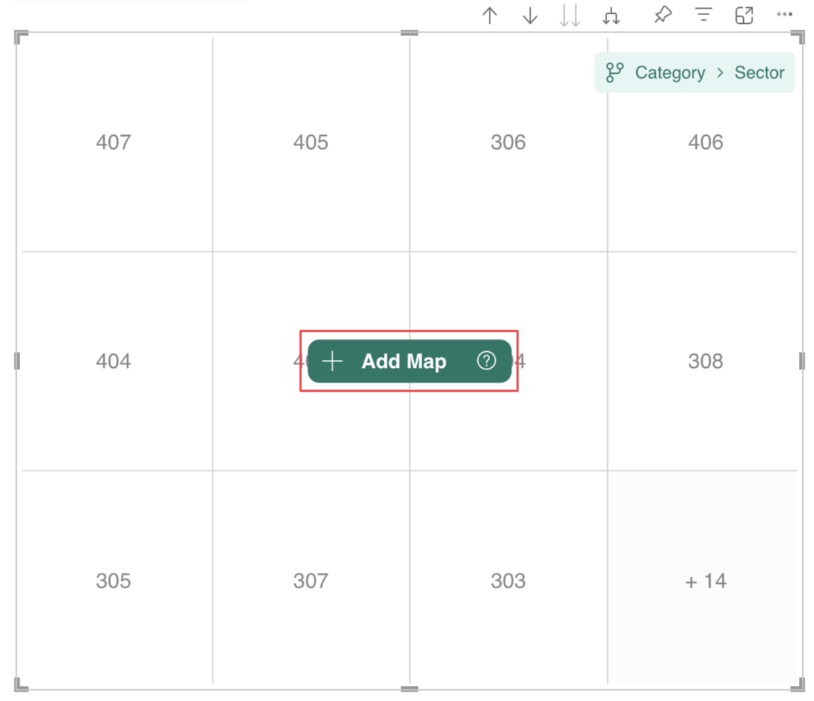

However, if **no maps are connected to the current drill path**, the button is positioned in the top-left corner. Once the maps are loaded, the [Map Editor](./map-editor/index.md) will open automatically.

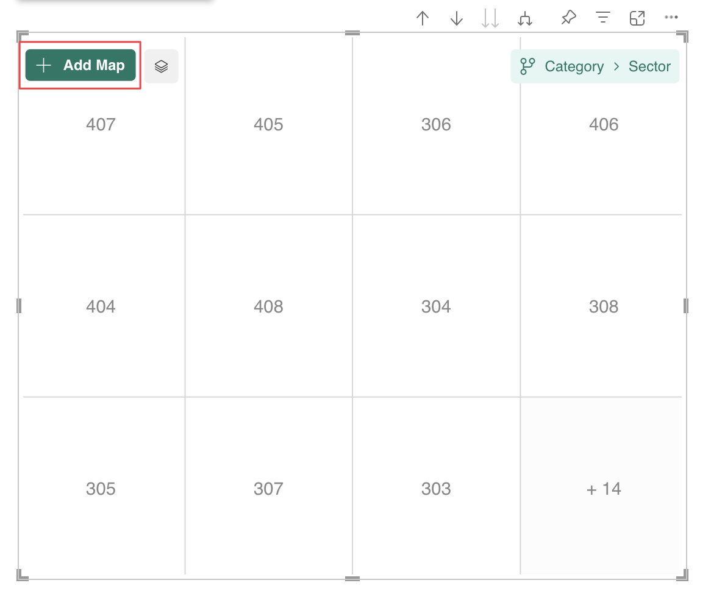

- **The current drill path already has a map connected**. You need to click on ***Edit icon***  in the visual [Toolbar](../features/toolbars.md#top-toolbar), which will open the [Map Editor](./map-editor/index.md) In the [Map Editor](./map-editor/index.md), you can click the ***+ Add*** button and choose the type of map you want to import. 

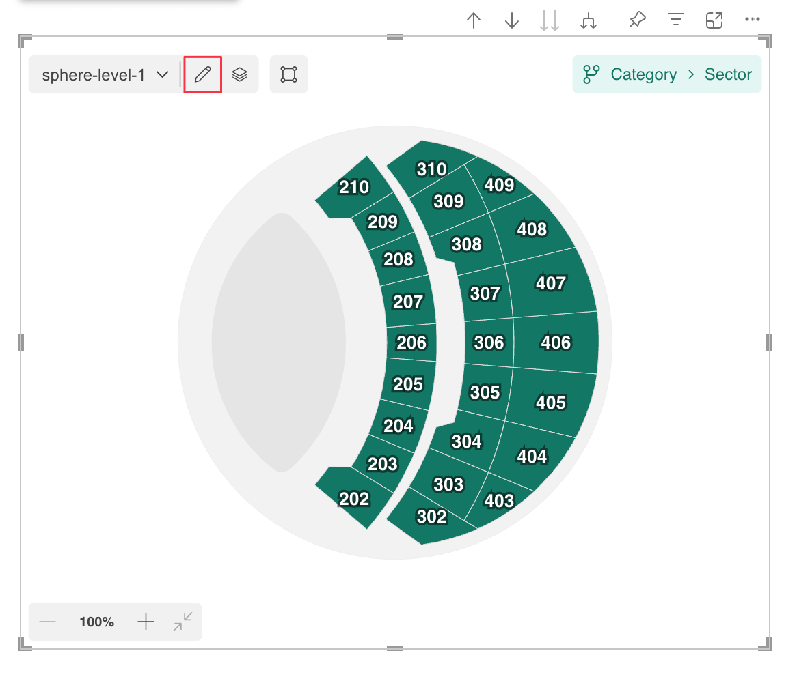

## Import Local Maps

If you have not yet connected the visual to your report, you can read how to start [Before Importing](./importing.md#before-importing).

To import local map(s) into Synoptic Panel, follow these steps:

1. Click ***+ Add Map*** and select the ***Local Map*** element.

    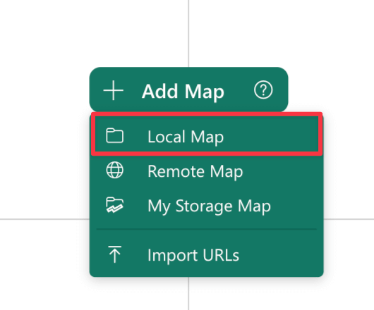

    If you have already loaded a map, you can click the ***+ Add*** button in the [Map Editor](./map-editor/index.md) dialog or drag and drop the files directly into the [Map List](../features/map-editor/layout.md#map-list).

    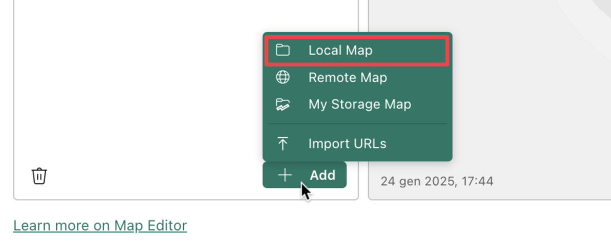

2. Select one or more files from your local machine.

Always keep in mind that **Local maps** are stored within the Power BI report file, meaning they are only accessible in the report where they were imported. Additionally, they are subject to [Size Limitations](#size-limitations).

>> Note that [Synoptic Panel with free license](../versions/index.md) has a limit of 1 local map per visual.

## Import a Remote Map

If you have not yet connected the visual to your report, you can read how to start [Before Importing](./importing.md#before-importing).

To import a remote map into Synoptic Panel, follow these steps:

1.  Click ***+ Add Map*** and select the ***Remote Map*** element.

    

    If you have already loaded a map, you can click the ***+ Add*** button in the [Map Editor](./map-editor/index.md) dialog.

    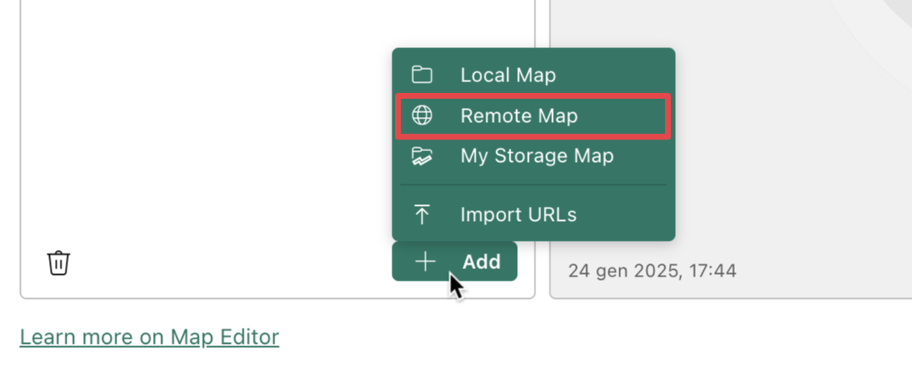

2. Enter the URL of the map and click ***Ok***.

For adding multiple URLs, refer to the next [Import Remote Maps from a JSON File](#import-remote-maps-from-a-json-file) section.

It is important to note that the URL must point directly to the SVG file and be **publicly accessible from the client**. This means the file should be hosted on a server that allows direct access without authentication or other restrictions. Additionally, popular cloud storage services cannot be used due to Cross-Origin Resource Sharing (CORS) restrictions, which prevent the visual from accessing files hosted on external platforms. Here is a list of some popular cloud services and their availability:

| Cloud Service | Availability  |
|---------------|---------------|
| Github        |&nbsp;&nbsp;&nbsp;&nbsp;&nbsp;&nbsp;&nbsp;🟢|
| OneDrive      |&nbsp;&nbsp;&nbsp;&nbsp;&nbsp;&nbsp;&nbsp;🔴|
| Google Drive  |&nbsp;&nbsp;&nbsp;&nbsp;&nbsp;&nbsp;&nbsp;🔴|
| Dropbox       |&nbsp;&nbsp;&nbsp;&nbsp;&nbsp;&nbsp;&nbsp;🔴|

>> Note that [Synoptic Panel Lite](../versions/index.md) does not support this feature.

## Import Remote Maps from a JSON File

If you have not yet connected the visual to your report, you can read how to start [Before Importing](./importing.md#before-importing).

To import multiple remote maps into Synoptic Panel, follow these steps:

1. Click ***+ Add Map*** and select the ***Import URLs*** element.

    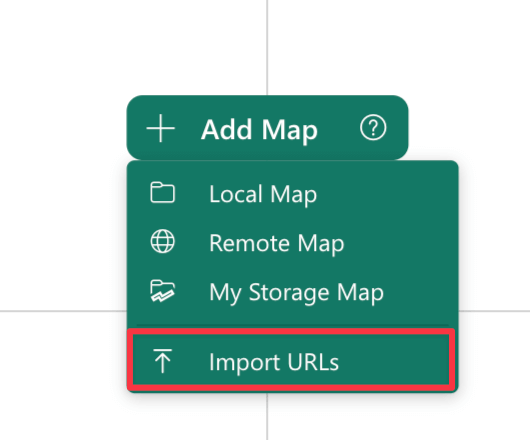

    If you have already loaded a map, you can click the ***+ Add*** button in the [Map Editor](./map-editor/index.md) dialog.

    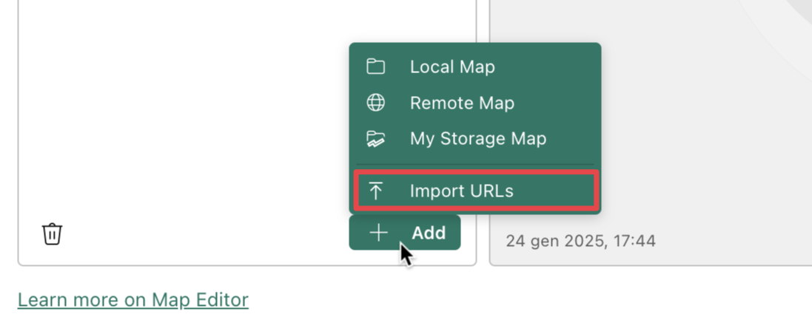

3. Select the JSON file containing the list of maps you want to import (see below).

### Import File Specifications

To automatically import multiple maps in Synoptic Panel, you need to provide a JSON file containing a list of map URLs, plus some additional information for each file. The JSON must have the following structure:

```json
[
    {
        "url": "https://example.com/map1.svg",
        "name": "Map 1",
        "mapSelector": "Store1",
        "drillPath": ["Category"]
    },
    {
        "url": "https://example.com/map2.svg",
        "name": "Map 2",
        "mapSelector": "Store2",
        "drillPath": ["Category", "Sector"]
    },
    ... // Other maps
]
```

Here is a description of the fields:

- **url**: The URL of the map file.
- **name**: *(Optional)* The name of the map. This is the name that will be displayed in the visual. If not provided, the name of the file will be used.
- **mapSelector**: *(Optional)* The value of the column bound as map selector. This is the column that will be used to switch between the maps. See more in the [Filtering Maps](../features/filtering-maps.md) section.
- **drillPath**: *(Optional)* This is an array of values used to build the **Drill Path**, which represent the drill level of the visual. This is a useful way to quickly assign different maps to different levels, but requires to know the exact values of the drill path components. See how the drill path is built in the [Drill Mode](/drill-mode.md#the-drill-path) section.
 If not provided, each imported URL will be assigned to the current drill level.

    > Note the Drill Path is displayed as a breadcrumb in the visual header. To define the `drillPath` value for the import file, you need to concatenate the single elements of the breadcrumb in the same order as they appear in the visual.  
    E.g. `Category > Sector` becomes `["Category", "Sector"]`.

>> Note that [Synoptic Panel Lite](../versions/index.md) does not support this feature.

##  Import My Storage Maps

If you have not yet connected the visual to your report, you can read how to start [Before Importing](./importing.md#before-importing).

To import map from [My Storage](./../features/my-storage.md) into Synoptic Panel, follow these steps:

1.  Click ***+ Add Map*** and select the ***My Storage Map*** element.

    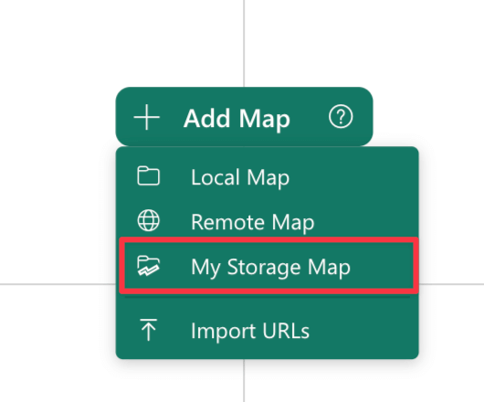    

    If you have already loaded a map, you can click the ***+ Add*** button in the [Map Editor](./map-editor/index.md) dialog.

    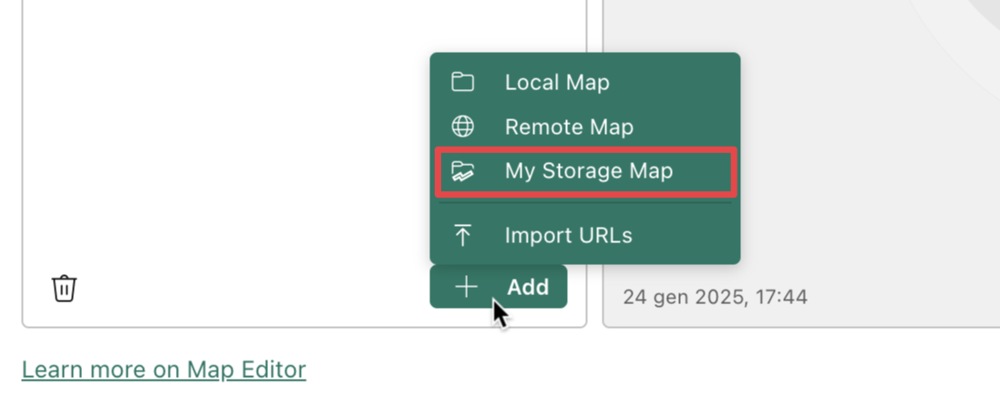

2. [Connect Map(s) to Visual](./../features/my-storage.md#connecting-maps-to-the-visual) from My Storage.

>> Note that only [Synoptic Panel with OKVIZ license](../versions/index.md) supports this feature.

## Replace Map(s) ##

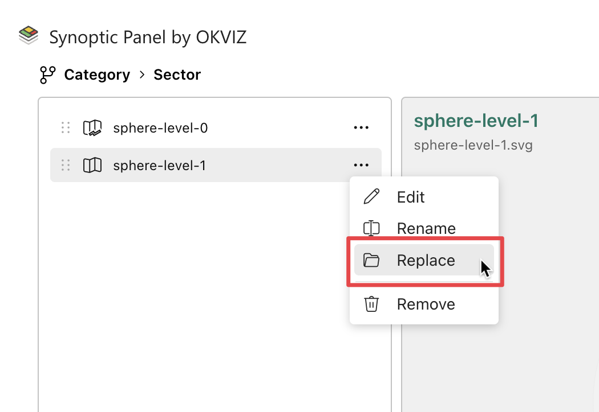

In Synoptic Panel, the ***Replace*** feature allows you to update an SVG map file while preserving the [data binding](../concepts/data-binding.md) already established. This can be useful when modifying a design, adding elements, or updating shapes. However, there are important considerations regarding the handling of IDs that could affect your setup during the replace process.

**ID Management and Data Binding**

Synoptic Panel relies on its [Auto Id Assignment](../concepts/auto-id-assignment.md) system to ensure unique IDs to areas of the map that lack predefined `<id>` attributes. If you replace the map with an updated SVG, issues may arise only when the following conditions occur:

1.	**Original SVG without predefined Ids**: If the previous map had areas without predefined `<id>` attributes, Synoptic Panel generated IDs automatically for those areas.

2.	**New SVG without redefined Ids**: If the updated SVG also has areas without predefined `<id>`  attributes, the Auto Id Assignment process may assign new IDs in a different order, especially if areas are added, removed, or reordered in the new file.

This could result in a mismatch between the existing data binding and the updated map because the assigned Ids in the new SVG may no longer align with the original ones.

**How to Avoid Issues**

To ensure smooth replacements and maintain data bindings:

1.	**Assign Ids in the SVG**: Whenever possible, define `<id>` attributes for all areas in the SVG before uploading it to Synoptic Panel. This prevents the Auto Id Assignment process from running and ensures that Ids remain consistent across updates.
2.	**Avoid Auto Id Dependency**: If your original map relied on Auto Ids, be cautious when updating the SVG. Removing or reordering shapes can disrupt the Id sequence and cause bindings to break.
3.	**Incremental Changes**: When modifying an SVG, avoid introducing or removing shapes that could shift the order of automatically generated Ids. Instead, preserve the structure and sequence of the original map.

## Size Limitations

To avoid performance issues, there are some limitations on the size of the map(s) that can be imported into Synoptic Panel:

- The **maximum size of a map** is 10 MB.

- The **maximum total size of all local maps** is 20 MB.

- When importing multiple files from local machine, the **total size of all files must not exceed 20 MB**.

If some of the above limits are exceeded, the visual will display an error message and the map will not be loaded. If your map is too large, see the [Best Practices](../concepts/best-practices.md) section for tips on how to optimize your map.