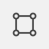

The Label Designer in Synoptic Panel is a built-in feature that allows for extensive customization of category and data labels, giving you full control over their appearance and behavior.

Label customizations are map-specific. Therefore, any settings applied within the Label Designer are unique to the currently displayed map and will not affect other maps. Moreover, custom labels are saved ***within the report***, so any custom styles or settings will not be reflected in other reports even with a shared My Storage map.

> Ensure that labels are enabled in the visual options to make them visible in the Label Designer. This applies to both category labels and data labels. Without activating them, the labels will not appear in the designer interface for customization.

## Entering Label Designer

To access the Label Designer, click on its icon  located within the [Top Toolbar](toolbars.md#top-toolbar) at the top-left of the visual and the system transitions into Power BI Focus Mode.

<video src="./images/label-designer-overview.mp4" autoplay loop muted></video>

Label Designer offers drag-and-drop functionality, allowing you to easily position labels on the map. You can also adjust the size of a label by dragging one of its corners, and rotate it by dragging the small circle located above the label. Alignment guides are also provided, enabling you to align labels quickly and intuitively for a polished and organized layout.

On the left side of the interface, you will find a pane to configure the appearance of the labels. Let's explore the available options:

## Apply To

**Default value:** (Selection)

Here you can choose whether to apply customization options to the ***selected labels only*** meaning the visible labels at the time of accessing the Label Designer. This is important to note because only the labels currently present in the data are displayed during customization. Or you can apply ***global*** customization options, meaning that all selected-type labels will keep the same appearance and behavior settings.

You can choose between the following options:

- `(Selection)` - Only selected labels will be customized.
- `Global: Category Label` - All category label will be customized, even those not visible at the time of customization.
- `Global: Data Label` - All data labels will be customized, even those not visible at the time of customization.

### Understanding Global vs. Specific Settings

The distinction between global settings and specific settings for selected labels is essential:
- **Specific Settings** (applied to selected labels) take priority over global settings, ensuring that the selected labels maintain their unique appearance and behavior.
- **Global Settings** affect all labels of a specific type (e.g., all category labels or all data labels), creating a consistent base configuration.

However, specific settings cannot completely override global settings.
<todo> Example and better explanation needed </todo>

## Connector

The Connector option allows you to draw a line between the label and the corresponding area on the map. This feature is particularly useful when you have overlapping labels or when you want to emphasize the connection between the label and the area it represents. Only labels with custom position will have a connector line.

### Line

Here you can define all the following option for the connector line:
- **Style** - Default: `Straight`. Choose between `Straight`, `Curved`, `Step` or `Arc`
- **Curviness/Stub** - Default: `0`. Adjust the curvature of the line
- **Gap** - Default: `1`. Set the distance of the line from both, the label and the area
- **Color** - Default: . Define the color of the line
- **Stroke Width** - Default: `1`. Set the thickness of the line

### Label Endpoint

Adjust the label endpoint by setting the following options:
- **Icon** - Default: `None`. Choose between `None`, `Circle`, `Rectangle` or `Arrow`
- **Anchor** - Default: `Auto`. Define the position of the icon in relation to the label, with options for `Center`, `Top`, `Bottom`, `Left`, `Right`, `Top-Left`, `Top-Right`, `Bottom-Left`, `Bottom-Right`. Select `Auto` to let the system decide the best position based on the label position or `Continuous` to have the icon always visible.

### Area Endpoint

Adjust the area endpoint by setting the following options:
- **Icon** - Default: `None`. Choose between `None`, `Circle`, `Rectangle` or `Arrow`
- **Anchor** - Default: `Auto`. Define the position of the icon in relation to the area, with options for `Center`, `Top`, `Bottom`, `Left`, `Right`, `Top-Left`, `Top-Right`, `Bottom-Left`, `Bottom-Right`. Select `Auto` to let the system decide the best position based on the area position or `Continuous` to have the icon always visible.

## Custom Style

Here you can set all the following options for the label style:

### Font

- **Family** - Default: `(Default)`. Choose the font family from a list of available fonts. `(Default)` option will use the same font as selected in the visual option for the selected label type.
- **Size** - Default: `Auto`. Set the font size in pixels. `Auto size` will use the same font size as selected in the visual option for the selected label type.
- **Bold** - Default: `Off`. Toggle the bold style.
- **Italic** - Default: `Off`. Toggle the italic style.
- **Underline** - Default: `Off`. Toggle the underline style.

## Custom Alignment

Here you can set the label alignment:

- **Vertical Alignment** - Default: `Middle`. Choose between `Top`, `Middle` or `Bottom`
- **Horizontal Alignment** - Default: `Center`. Choose between `Left`, `Center` or `Right`

## Custom Position

Here you can fine-tune the label position by setting the following options:

- **Horizontal Offset**. Adjust the horizontal position of the label in pixels against the default position.
- **Vertical Offset**. Adjust the vertical position of the label in pixels against the default position.
- **Rotation**.  - Default: `0`. Rotate the label by a specified angle in degrees.

## Custom Size

Here you can set the label size:

- **Width** - Default: `Auto`. Set the width of the label in pixels. `Auto` will allow the label to adjust its width based on the content. Once you set a custom width, the label will not resize based on the content.

- **Height** - Default: `Auto`. Set the height of the label in pixels. `Auto` will allow the label to adjust its height based on the content. Once you set a custom height, the label will not resize based on the content.

## Visibility

Here you can set the visibility of labels and background:

- **Hide Labels** - Default: `Off`. Toggle the visibility of the labels.
- **Hide Background** - Default: `Off`. Toggle the visibility of the label background.