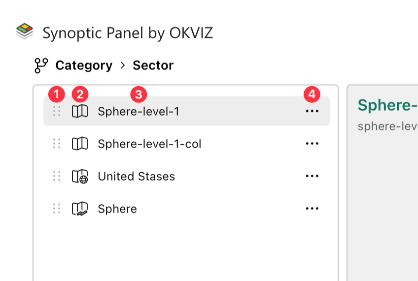
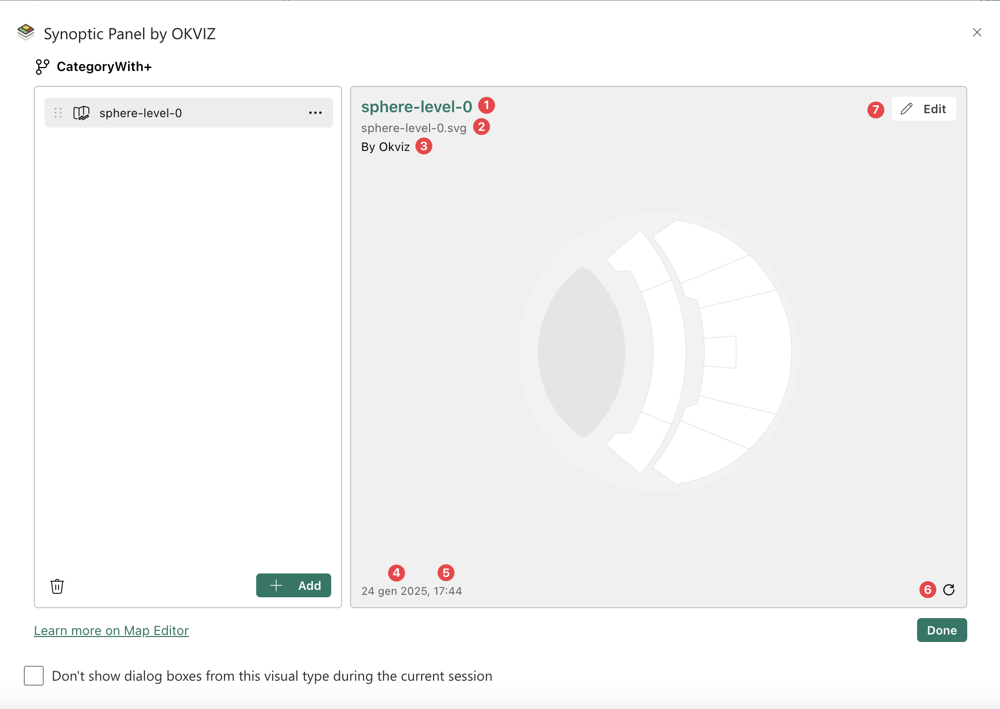
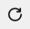

The Map Editor interface is designed for intuitive navigation and interaction, with two main sections: the ***Map List*** on the left and the ***Map Preview*** on the right.

<video src="./images/map-editor-interface.mp4" autoplay loop muted></video>
## Map List

This pane displays a list of maps currently loaded in the visual and connected to the current [Drill Path](./../concepts/drill-paths.md) shown at the top of the panel (e.g., ***Category > Sector*** in the provided example). To see and manage all maps connected to the visual in other Drill Paths you can use the [Map Manager](./map-manager.md).

**Map**

Each element in the list includes:
- **Drag Icon**(1): Allows you to reorder the maps by dragging and dropping them.
- **Map Location Icon**(2): Indicates the location (**Local**, **Remote** or **MyStorage**) of the map file.
- **Map Title**(3): Displays the name of the map.
- **Map Menu Icon**(4): Allows to open the map context menu to perform action for the selected map.

**Additional Features**

- **Add New Map(s)**: Enables you to upload new map files either by clicking the **Add** button or by dragging and dropping files directly into the list pane (only for **Local Maps**).
- **Delete All**: deletes all maps from the list in one action, by clicking the delete icon in the bottom left.
- **Reordering**: maps in the list can be rearranged easily by dragging them using the map Drag Icon. 

    > Note that the order of the maps in the list will determine the order in which they are displayed in the map dropdown list in the visual.

<video src="./images/map-editor-features.mp4" autoplay loop muted></video>

## Map Preview

This section provides useful information and a visual preview of the currently selected map.
The map is displayed in the center of the pane while in the corners you can find some useful information and tools.

**Main Detail** - Top-Left

Here are displayed the following key details:
- ***Map Title***(1): The name of the map currently in preview.
- ***Map Source***(2): The source of the selected map, which varies depending on the type of map:
	- For local maps, the source displays the file name that originated the map (e.g. my-file.svg).
	- For remote maps, the source shows the URL where the map is hosted.
	- For MyStorage maps, the source displays the map’s unique ID in the storage system.
- ***Map Author***(3) - if available: Displays the author of the map.

**Additional Information** - Bottom-Left

Below the preview, the following information is displayed:
- ***Last Modified Date***(4): The date and time the map was last updated.
- ***File Size***(5): The size of the map file (only for **Local** maps).

**Refresh Icon**(6) - Bottom-Right, if available

For remote maps, ***Refresh Icon***  allows you to reload the map to ensure it is up to date.

**Edit Button**(7) - Top-Right, if available

It provides access to the editing tool. See how to [Edit Map](edit-map.md) for more information.