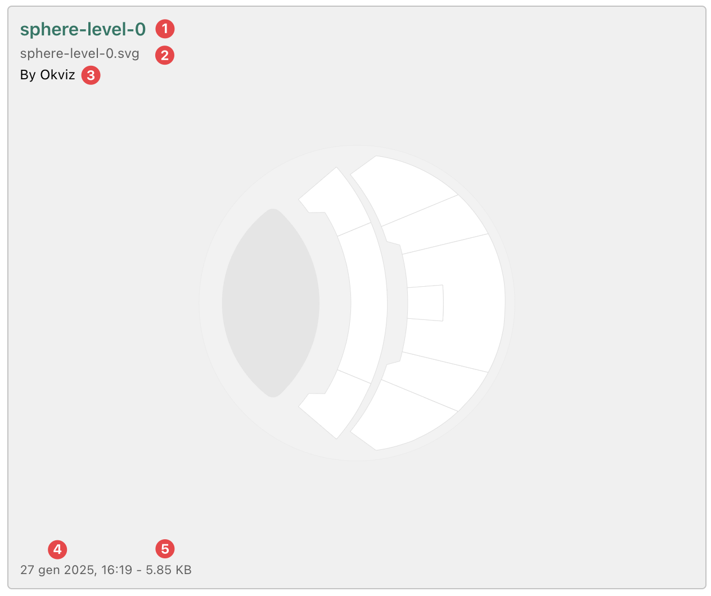

The Maps Manager provides an overview of **all the maps connected to the visual** and their associated [Drill Paths](./drill-mode.md#the-drill-path) It is a powerful tool to manage maps efficiently and offers functionality for organizing, previewing, and editing connections between maps and drill paths.

<video src="./images/map-manager.mp4" autoplay loop muted></video>

The Maps Manager interface is visually similar to the [Map Editor](./map-editor.md) and is divided into two main sections:

**Drill Paths Tree** (Left pane)

This pane displays a hierarchical view of all Drill Paths to which maps are connected. Each drill path is represented as a node in the tree, and each node can contain one or more maps.

> [Child Maps](child-maps.md), that are children of specific areas in a parent map, are not displayed in the Maps Manager.

- The tree structure is expandable, and each drill path and map is associated with a checkbox.
- Checkboxes allow users to delete multiple maps.
- All maps can be previewed by clicking on the map element in the tree.
- Both, drill paths and maps, has a context menu that allows you to perform actions for the selected item, such as deleting, renaming, or move to another drill path.
- You can search for specific drill paths or maps  by using the search bar at the top of the tree.

**Map Preview** (Right pane)

This section provides useful information and a visual preview of the currently selected map.
The map is displayed in the center of the pane while in the corners you can find some useful information and tools.

**Main Detail** (Top-Left)

Here are displayed the following key details (in order from top to bottom):
- ***Map Title***(1): the name of the map currently in preview.
- ***Map Source***(2): the source of the selected map, which varies depending on the type of map:
	- For local maps, the source displays the file name that originated the map (e.g. my-file.svg).
	- For remote maps, the source shows the URL where the map is hosted.
	- For MyStorage maps, the source displays the map’s unique ID in the storage system.
- ***Map Author***(3) - if available: Displays the author of the map.

**Additional Information** (Bottom-Left)

Below the preview, the following information is displayed:
- ***Last Modified Date***(4): the date and time the map was last updated.
- ***File Size***(5): the size of the map file (only for **Local** maps).

**Refresh Icon** (Bottom-Right, if available)

For remote maps, a ***Refresh Icon***  may appear, allowing you to reload the map to ensure it is up to date.