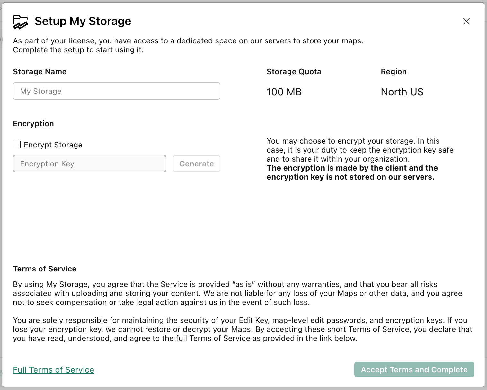
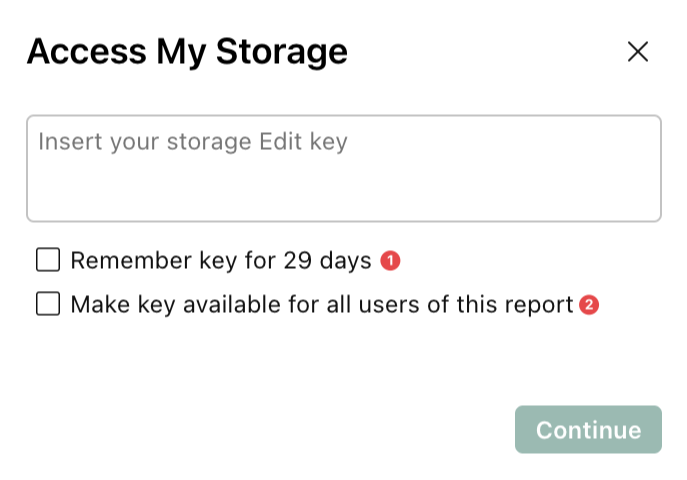
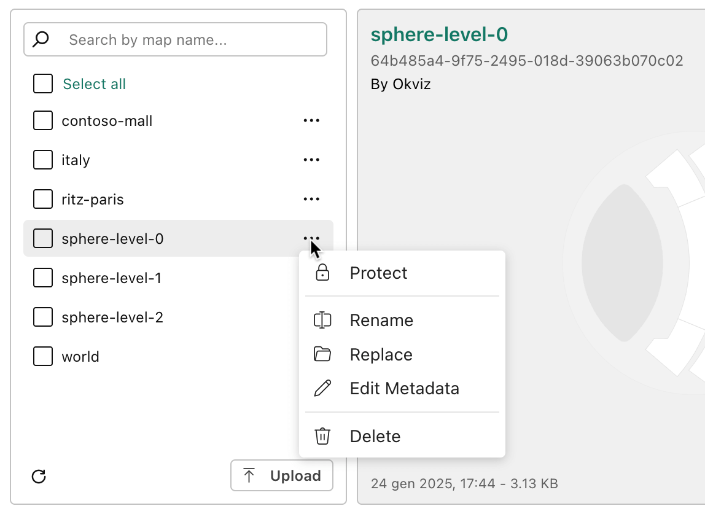
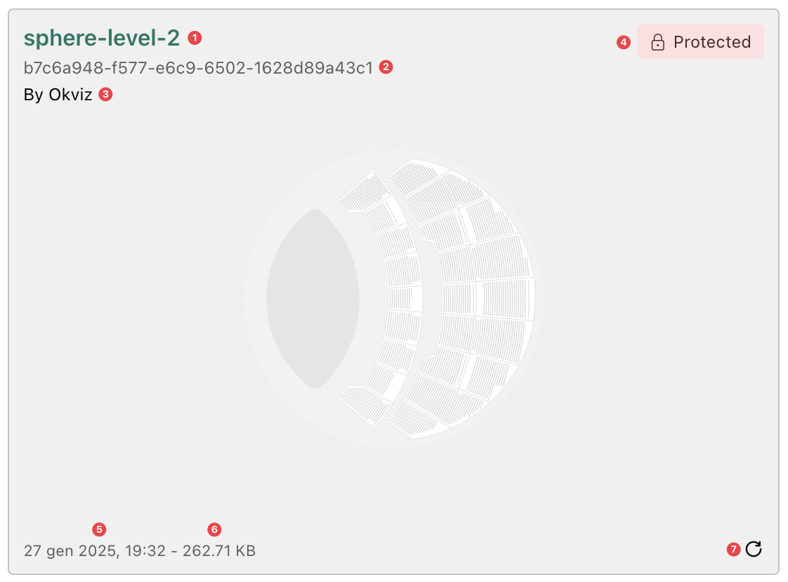
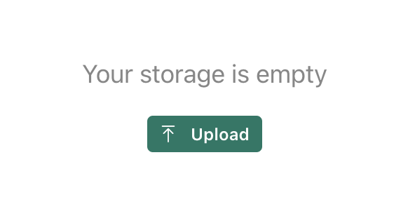
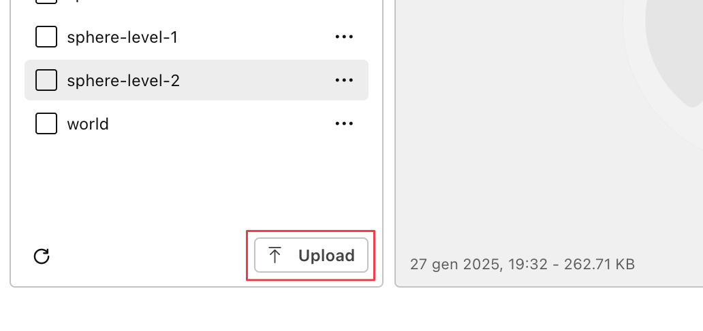

My Storage provides an online storage space hosted on third-party servers (e.g., Microsoft Azure) that allows you to upload, store, and manage SVG maps for use within Synoptic Panel. Make sure to read the entire [terms and conditions](./../legal/my-storage-tos.md) and the [Security section](./../security/my-storage.md) before using this feature.

>> Note that [Synoptic Panel Lite](../versions/index.md) does not support this feature.

## Setup

When accessing MyStorage for the first time, you will be prompted to:

1.	***Set a Name***. Choose a unique name for your My Storage instance, which will identify your storage within the organization.

2.	***Define an [Encryption Key](#encryption-and-encryption-key)*** (Optional). This is used to secure your maps.

## Edit Key

To use My Storage, you must have [Synoptic Panel with OKVIZ license](../versions/index.md). When you purchase this license, you will be provided with an Edit Key, which serves as your administrative credential to list, manage, and edit maps stored in My Storage. Without the Edit Key, you cannot access the editing interface or manage uploaded content.

**Providing the Edit Key**

When accessing My Storage, you will be prompted to enter the Edit Key. You can choose one of the following options for convenience:

- ***Remember key for 29 days***(1):
Temporarily saves the Edit Key in your browser’s local storage, allowing you to reuse it for future sessions for 29 days. This option is useful if you frequently access My Storage from the same device and browser.

- ***Make key available for all users of this report***(2):
Stores the Edit Key directly in the report. This ensures it is available whenever the report is opened, but it is tied to that specific report.

If you choose not to save the Edit Key, you will need to re-enter it each time you access My Storage. If you selected one of the save options, you can change it at any time by toggling the [Save Edit Key](./../options/my-storage/keys.md#save-edit-key) setting in the visual properties, removing the saved key from the report and/or local storage.

## Encryption and Encryption Key

You can specify an ***Encryption Key*** to secure your maps. This key encrypts all the maps stored in My Storage, ensuring they are saved on the server in an encrypted format. Only authorized users with the correct encryption key can access and decrypt these maps.

If you enable encryption, it is essential to safeguard your encryption key. The key is not stored or accessible by OKVIZ, and if it is lost, there is no way to restore or decrypt the encrypted maps.

**Important Notes on Encryption**:

- The encryption key is required during the initial [My Storage Setup](#setup) to activate encryption for uploaded maps.
- To view or use encrypted maps in a report, the encryption key must also be provided in the related [visual property](./../options/my-storage/keys.md#encryption-key).
- If the encryption key is not provided or is incorrect, users will not be able to access or use the encrypted maps.

    
## Access My Storage

When [Importing My Storage Maps](./../features/importing.md#import-my-storage-maps), the My Storage window is displayed, unless the [Edit Key](#edit-key) needs to be entered.

### Window Layout

My Storage window is divided into tree main sections:

<video src="./images/my-storage-layout.mp4" autoplay loop muted></video>

1.	**Map List** (Left Pane):

    This section displays the list of all maps stored. You can browse through the list and select one or more maps to be associated with the current [Drill Path](./drill-mode.md#the-drill-path). Each map can be previewed, renamed, replaced, protected or deleted directly from the list. 

    

2.	**Map Preview** (Right Pane):

    The right panel shows a preview of the map selected from the list, allowing you to verify its content before adding it to the visual. The map is displayed in the center of the pane while in the corners you can find some useful information.

    

    - ***Map Title***(1): the name of the map currently in preview.
    - ***Map Id***(2): unique ID in the storage system.
    - ***Map Author***(3) - if available: the author of the map.
    - ***Protected Marker***(4): indicates if the map is protected with a password.
    - ***Last Modified Date***(5): the date and time the map was last updated.
    - ***File Size***(6): the size of the map file on the server.
    - ***Refresh Icon***(7): allows you to reload the map to ensure it is up to date.

3. **Header**:

    In the header you will find the current ***Region*** and ***Storage Available Quota***. The region indicates the location where your storage is hosted (which is defined when purchasing the license), while the quota shows the remaining space available in your storage out of the total space.

### Upload Maps

Uploading maps means selecting one or more local files from your machine and saving it to My Storage. Once a map is uploaded, it becomes available to all users of My Storage within your organization. However, uploading a map does not automatically connect it to the visual.

How to Upload:
1.  If My Storage is empty(i.e., no maps have been uploaded yet), click the ***Upload*** button in the center of the screen.

    

2.	If maps are already present, the ***Upload*** button is located at the bottom of the ***Map List*** pane.

    

3.	Select the local files you want to upload from your machine.

#### **Upload Limitations** ###

- **File Size Limit**: Each file must not exceed 10 MB.
- **Total Upload Limit**: A maximum of 20 MB can be uploaded in a single operation.
- **Image Optimization**: Embedded bitmap images in SVG maps will be compressed based on the [Image Quality](./../options/advanced-options/performance.md#image-quality) setting.

### Connecting Map(s) to the Visual

To connect a map to the current [Drill Path](./drill-mode.md#the-drill-path) within the visual:

1.  **Upload the Map**: the map must first be [uploaded to My Storage](#upload-maps).

2.	**Select the Map**: use the checkbox next to the map name in the list to select the map you want to connect.
    - Multiple maps can be selected by checking multiple checkboxes.
    - To select all maps in the list, use the ***Select All*** element at the top of the list.

3.	**Add the Selected Maps**: click the ***Add Selected*** button to connect the selected maps to the current [Drill Path](./drill-mode.md#the-drill-path) in the visual.

Maps that are already connected to the current Drill Path will appear grayed out and cannot be selected again.

<video src="./images/my-storage-connect-maps.mp4" style="clip-path:inset(0 0 2px 0)" autoplay loop muted></video>

### Map Protection

Each map in My Storage can be protected with a password. This feature ensures that unauthorized users cannot edit or delete the map without the correct password.

**Edit and Delete Restrictions**:
- Users must provide the password to edit or delete the map.
- Without the password, attempts to edit, replace or delete the map will be blocked.

**Read and Usage Permissions**:
- Password protection does not restrict the ability to view or use the map in read-only mode.
- Protected maps can still be added to visuals and used in reports by all authorized users with access to My Storage.

**Map Editor Access**:
- Users can open the map in the Map Editor even without the password.
- However, they cannot save changes directly to the original My Storage map.
- Users can save a local copy of the map and eventually upload it to My Storage as a new map.

**Setting a Password for a Map**:

1.	Open the My Storage window and select the map you wish to protect.
2.	Click the ***Protect*** option from the map’s contextual menu (accessible via the three-dot menu).
3.	Enter and confirm the desired password.

<video src="./images/my-storage-add-protection.mp4" autoplay loop muted></video>

> If the password is lost, editing or deleting the map will no longer be possible. Make sure to keep the password secure.

It is possible to update or remove the password at any time. To do so, just select ***Unprotect*** or ***Change Password*** from the map’s contextual menu and confirm the action, providing the current password.