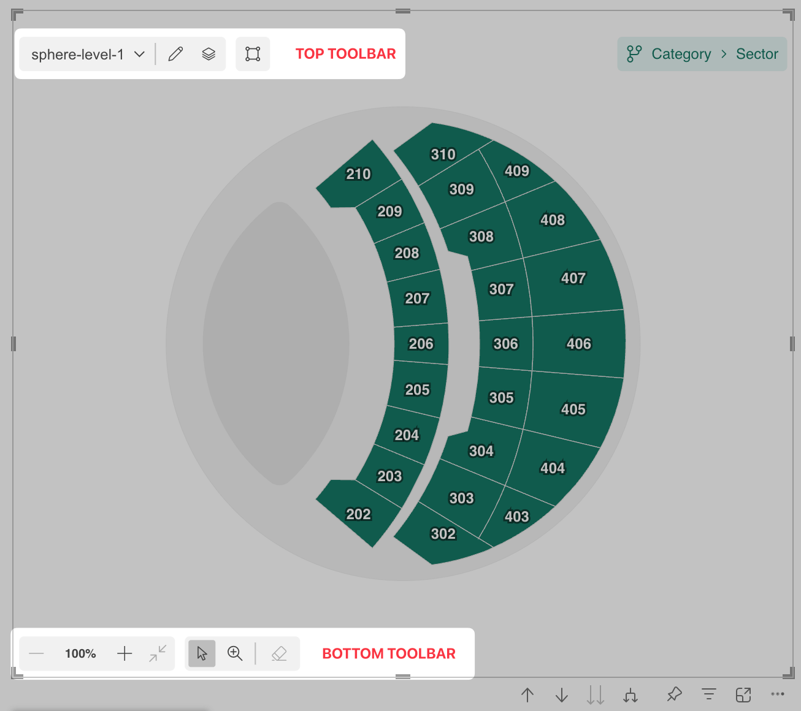
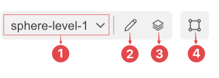
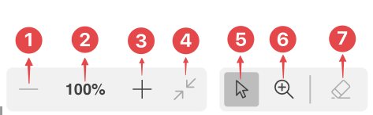

In Synoptic Panel, two distinct ***Toolbars*** are available to enhance the usability and customization of the visual:

1. **Top Toolbar**: positioned in the top-left corner of the visual, visible only in ***Edit View***.

2. **Bottom Toolbar**: located at the bottom of the visual, accessible to all users for managing graphical and interactive aspects of the map.

## Top Toolbar

The **Top Toolbar** allows users to manage and configure the visual’s structure. This toolbar is only displayed in Edit Mode and contains the following elements:

- ***Map Dropdown***(1): displays a list of all maps within the current drill path. You can use this dropdown to quickly switch between maps.
- ***Edit Icon*** (2): opens the [Map Editor](./map-editor/index.md) , where you can manage and edit maps.
- ***Maps Manager Icon*** (3): launches the [Maps Manager](map-manager.md), which provides an overview of all connected maps and drill paths.
- ***Label Designer Icon*** (4): Opens the [Label Designer](label-designer.md) , where you can configure the appearance and behavior of labels on your maps.

## Bottom Toolbar

The ***Bottom Toolbar*** focuses on user interaction with the visual, enabling dynamic adjustments to the map’s appearance and behavior. It is located at the bottom of the visual and includes the following controls:

**Zoom Controls**
- ***Zoom In***(1): Magnifies the map for a closer view.
- ***Zoom Percentage***(2): Displays the current zoom level.
- ***Zoom Out***(3): Reduces the map size for a broader perspective.
- ***Reset Zoom***(4): Resets the zoom level to the default view.

**Selection Tools**
- ***Select Elements***(5): Enables selection of specific areas or elements within the map.
- ***Focus on Area***(6): Centers and zoom the view on a selected area of the map.
- ***Clear Selection***(7): Deselects any previously selected elements.

## Configurability

Both toolbars in Synoptic Panel are designed to be highly customizable, allowing users to tailor their functionality and appearance to better suit their needs. For instance, you can configure whether the toolbars remain permanently visible (pinned) or automatically hide and reappear when the mouse hovers over the visual. The background color of the toolbars can also be adjusted to better align with the visual’s overall design.

Additionally, you have the option to simplify the interface by showing or hiding certain buttons, particularly on the Interactive Toolbar, and even decide whether to display the Map Dropdown. However, it is important to note that the dropdown visibility can only be adjusted when the visual is in Reading View.

All these options, along with others, are conveniently accessible within the [Toolbar](./../options/toolbars/index.md) section of the visual’s properties panel, making it easy to customize the toolbars to your preferences.