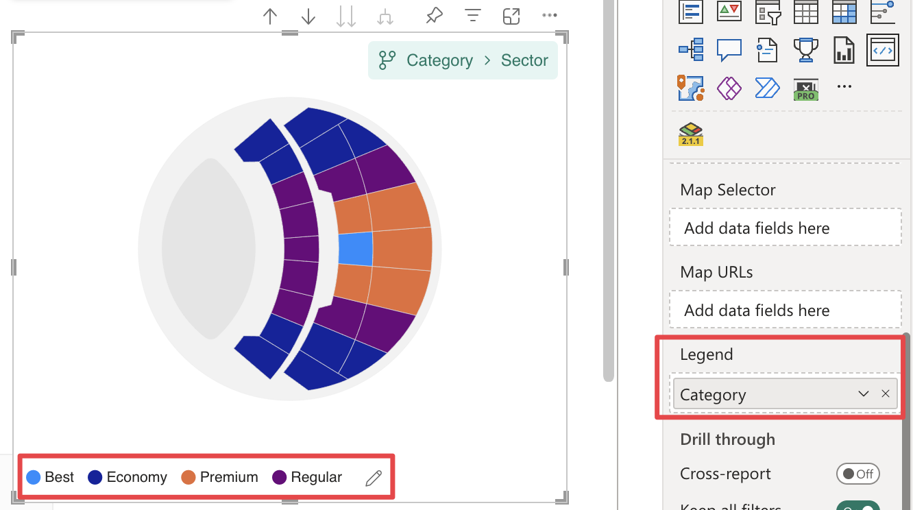

The Legend field well is where you can connect a column or measure to define the legend values for the visual. When a column is added here, Synoptic Panel will categorize the mapped areas based on the values in that field, applying distinct colors and styles. Learn more about this feature in the [Legend](./../features/legend.md) section.

