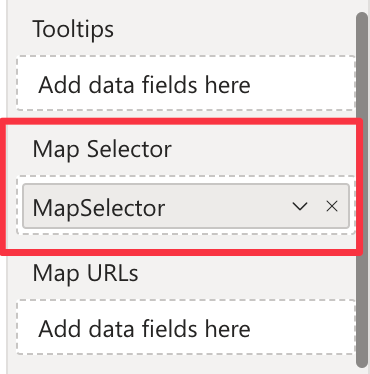

The Map Selector field well allows you to link a measure of the dataset representing a selector for the maps that can be displayed. This field is useful when you have multiple maps in the same visual and you want to switch between them based on a specific filter. You can learn more about this feature in the [Map Selector](./../features/filtering-maps.md#map-selector) section.

