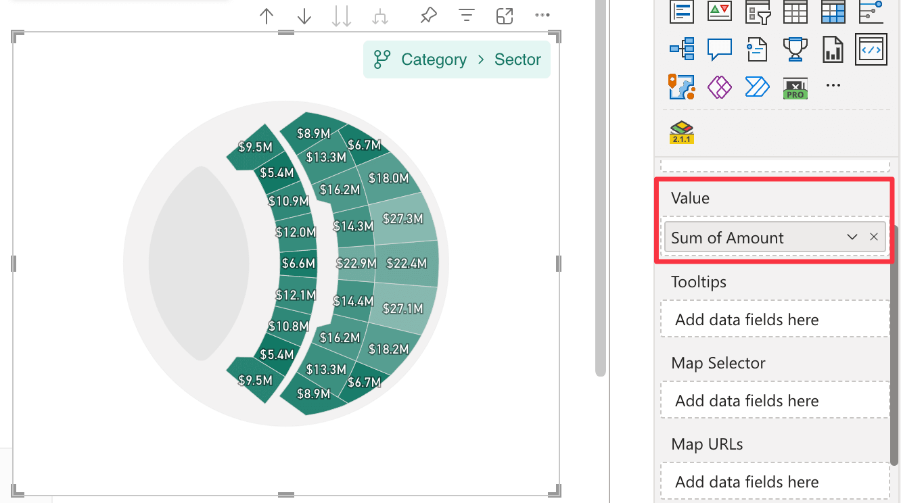

In the Value field well you can connect one column or measure in your dataset to represent the value of the map areas. The value is used to determine the color, label, tooltips and other properties of the map areas.

