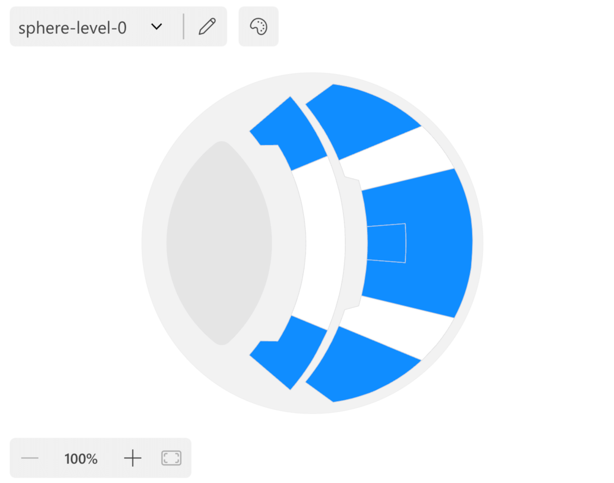
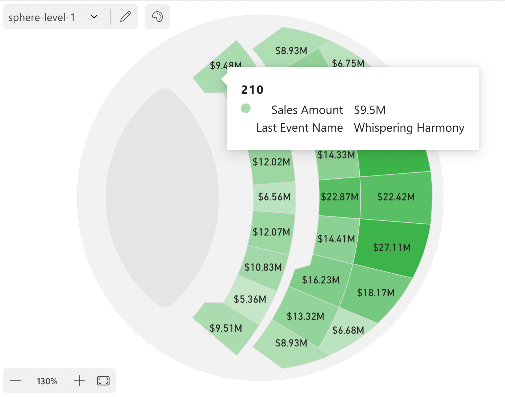

In this section, you will learn how to install and use Synoptic Panel in a Power BI report. This is a quick guide to get you started; for more detailed information, refer to the [Concepts](../concepts/index) and [Features](../features/index) sections.

## Installation

1. Open a new report on Power BI Desktop or [Power BI Service](https://app.powerbi.com).

2. Import the visual into your report:
            
    - For **beta users**:
        - Follow the instructions in the email that you have received from OKVIZ.

    - In case you have purchased a license directly **from OKVIZ:**
        - Import the visual file (.pbiviz) that you have received by email as [explained here](../../get-started/installation#from-a-file).
    
    - In case you have purchased a license **from AppSource**:
        - Import the visual by searching for *"Synoptic Panel"* or *"okviz"* in the AppSource marketplace, as [explained here](../../get-started/installation#from-appsource).

3. Drag and drop the visual on the report canvas.

    

## Load a Map

4. Before you can use the visual, you need to bind at least a column to the ***Categories*** field well.

    <video src="images/drag-category.mp4" autoplay loop muted></video>

5. After you doing so, you will see a simple grid containing a few records from the column you have just bound. This is a non-fully functional placeholder that will be replaced by the actual map once you have configured it ([what are maps?](../concepts/maps/index)). To proceed, click on the ***+ Add Map*** button.

    

6. You can choose the map from [different locations](../features/importing.md). For this time, click on ***Local Map(s)*** to select an SVG image from your local computer.

    > Don't have a map yet? Download a sample one from our [maps repo on Github](https://github.com/okviz/synoptic-panel-maps).

7. Once you have selected a map, click the ***Done*** button to close the dialog and see the map in the visual.

8. At this point, some areas of the map may be highlighted in different colors. This happens when  automatic binding is applied. **Automatic binding** is a feature that tries to match the `id` of the map elements with the values of the column you have bound to the ***Categories*** field well. If the matching is successful, the areas become interactive, can be colored, and can display labels and tooltips. If the match is not successful, the areas are colored by default with a grayscale color (but you can choose to use the original color if you wish).

    See more in the [Data Binding](../concepts/data-binding.md) section.

    

## Adjust the Binding

If the automatic binding is not working as expected, you can adjust it manually. To do so, click on the pencil button in the visual toolbar to open the **Map Editor**.

Through the Map Editor, you can change the automatic binding settings of every shape of the map, choosing to force the binding to a specific value or to disable it. Also, you can add additional data to the map, such as area titles and map metadata.

See more in the [Map Editor](../features/map-editor.md) section.

## Add Values

The main purpose of Synoptic Panel is to visualize data on the map. To do so, you need to bind one or more measures to the visual:

- Bind a measure to the ***Value*** field well to connect it to the map areas. The values of this measure could be displayed in labels or used to color the areas of the map.

- Bind one or more measures to the ***Tooltips*** field well to display them as tooltips when hovering over the map areas.

## Add Conditional Formatting

You can customize the color of your map areas according to the value of the measure you have bound to the ***Value*** field well or any other measure you have in your dataset. To do so, you need to define the conditional formatting as you usually do in built-in Power BI visuals.

  
  

## Next Steps

Now that you have a working visual you can start customizing it and exploring the advanced features of Synoptic Panel. For example, you can:

- Customize the visual appearance by changing the color, font, and position of labels. See more in the [Options](../options/index) section.

- Add multiple levels to your visual to create a browsable hierarchy of maps. See more in the [Drill Mode](../features/drill-mode.md) section.

- Connect the maps to a specific measure to create a dynamic visualization that changes based on the actual report filter. See more in the [Filtering Maps](../features/filtering-maps.md) section.

- And much more!