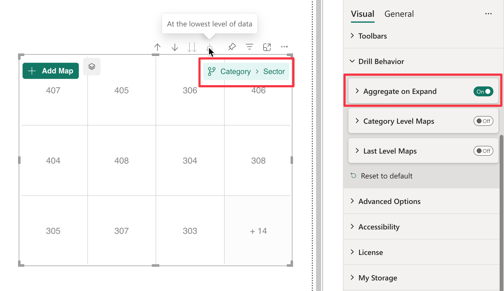

**Default value:** On

The ***Aggregate on Expand*** option controls how hierarchical data is aggregated when you ***Expand all down one level in the hierarchy***.

> Read more on how different data aggregation impacts [Automatic Binding](./../../concepts/data-binding.md#automatic-binding-when-hierarchy-is-expanded) when ***Expand all down one level in the hierarchy***

Consider the following dataset with a hierarchy of ***Category → Sector***:

    <table width="50%">
    <tr><th colspan="3">Hierarchy</th></tr>
    <tr>
        <th>Category</th>
        <th>Sector</th>
    </tr>
    <tr>
        <td>Economy</td>
        <td>202</td>
    </tr>
    <tr>
        <td>Economy</td>
        <td>203</td>
    </tr>
    <tr>
        <td>Premium</td>
        <td>305</td>
    </tr>
    <tr>
        <td>Premium</td>
        <td>307</td>
    </tr>
    <tr>
        <td>Regular</td>
        <td>204</td>
    </tr>
    <tr>
        <td>Regular</td>
        <td>205</td>
    </tr>
        <tr>
        <td>Best</td>
        <td>306</td>
    </tr>
    <tr>
        <td colspan="2" style="text-align:center;" >......</td>
    </tr>
</table>
 

When the option is ***Enabled***, data points are aggregated, meaning only the values corresponding to the deepest level of the hierarchy navigated are received and displayed. This allows for a simplified representation where only the relevant category at the current level is shown. So if you expand the hierarchy to the ***Sector*** level, only the values for the sectors are displayed.

<figure>
    
    <figcaption>
        Data Points: 306; 202; 203; 305; 307; 204; 205 ...
    </figcaption>
</figure>

When the option is ***Disabled***, data points are not aggregated, meaning each data point includes the full hierarchical path, containing the names of all parent categories up to the top level. As a result, every data point retains its full path in the dataset.

<figure>
    
    <figcaption>
        Data Points: Best \ 306; Economy \ 202; Economy \ 203; Premium \ 305; Premium \ 307; Regular \ 204; Regular \ 205 ...
    </figcaption>
</figure>