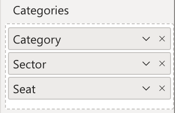
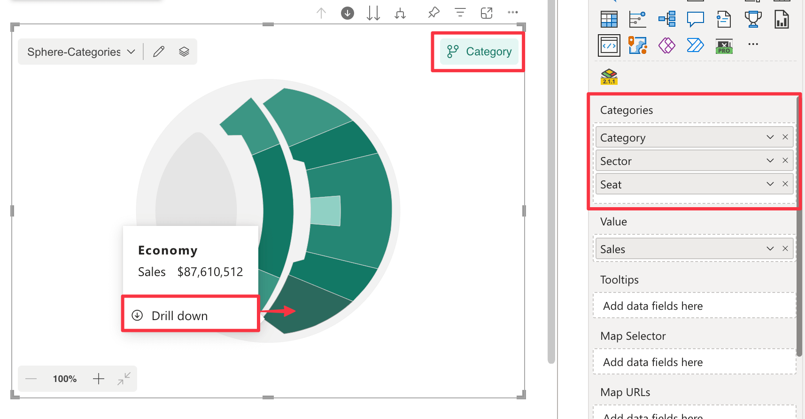
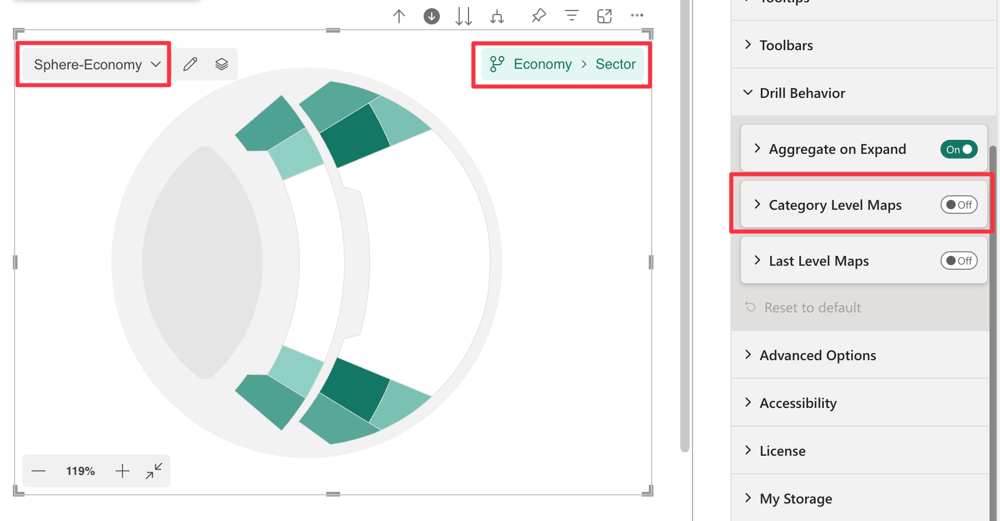

**Default value:** Off

This option determines which maps are displayed when performing a drill-down on a single data point (i.e., clicking on an individual area of the map). Since maps are linked to [Drill Paths](./../../features/drill-mode.md#the-drill-path), this setting controls whether the drill-down reaches a category-level maps or a data point-specific maps.

So the key difference is which drill path is reached after the drill-down, while data points filtering behavior remains unchanged in both cases:

- When ***Disabled*** (default): The drill-down selects maps associated with the specific data point.
- When ***Enabled***: The drill-down selects maps at the category level.

## **Example**

Consider the following dataset with a hierarchy of ***Category → Sector → Seat***:

    <table width="50%">
    <tr><th colspan="3">Hierarchy</th></tr>
    <tr>
        <th>Category</th>
        <th>Sector</th>
        <th>Seat</th>
    </tr>
    <tr>
        <td>Economy</td>
        <td>210</td>
        <td>SPH00961</td>
    </tr>
    <tr>
        <td>Economy</td>
        <td>310</td>
        <td>SPH00447</td>
    </tr>
    <tr>
        <td>Premium</td>
        <td>305</td>
        <td>SPH06856</td>
    </tr>
    <tr>
        <td>Premium</td>
        <td>307</td>
        <td>SPH06484</td>
    </tr>
    <tr>
        <td>Regular</td>
        <td>204</td>
        <td>SPH03440</td>
    </tr>
    <tr>
        <td>Regular</td>
        <td>205</td>
        <td>SPH03734</td>
    </tr>
        <tr>
        <td>Best</td>
        <td>306</td>
        <td>SPH09060</td>
    </tr>
    <tr>
        <td colspan="3" style="text-align:center;" >......</td>
    </tr>
</table>
 

You are currently at the ***Category*** level. You click on an area of the map corresponding to ***Economy***.

 

The drill-down is performed with the following scenarios:

1. **Category Level Maps Disabled** (default)

	- The drill-down moves directly from ***Category*** to ***Economy-Sector*** drill path.
	- The data points are filtered by ***Economy***.
    - You can only display maps linked to the ***Economy-Sector*** drill path.

    This is the default behavior, which allows you have ***separate maps for each data point***.

    

1. **Category Level Maps Enabled**

    - The drill-down moves from ***Category*** to ***Category-Sector*** drill path.
    - The data points are still filtered by ***Economy***.
    - You can only display maps linked to the ***Category-Sector*** drill path.

    This is beneficial if you prefer to highlight selected data points within the ***category level map***.

    