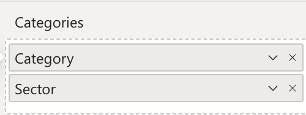
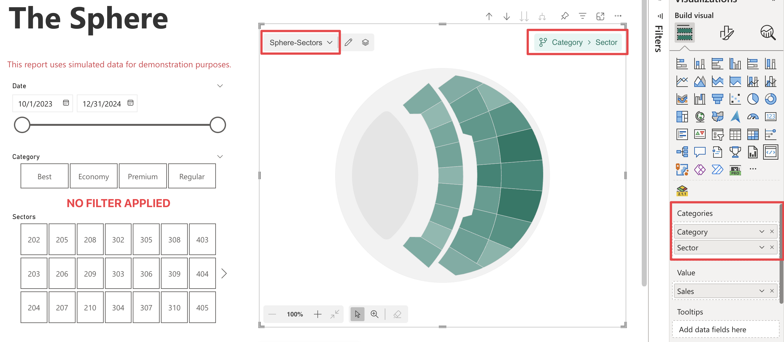
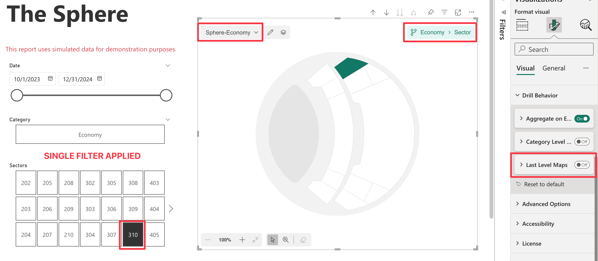
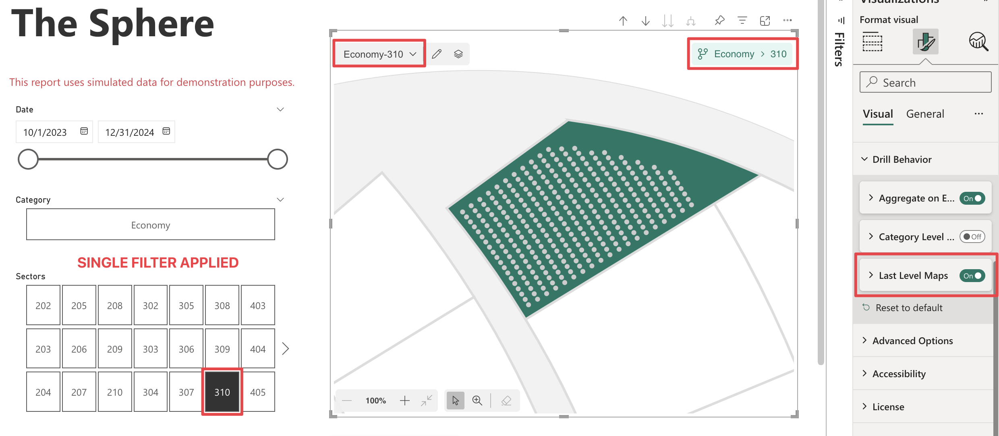

**Default value:** Off

By default, you can associate a map with each data point at every level of the hierarchy, except for the last level. However, enabling this option allows you to associate maps even with data points at the last level. To display a map in this scenario, you must apply a single filter to the data points using an external slicer or the filter pane.

> Note that [Category Level Maps](./category-level-maps.md) option must be disabled to use this feature.

>> Be aware that changing the *Last Level Maps* setting after maps have been associated may make some maps no longer reachable, as the Drill Path will be different. In this case, you can always manage the assigned maps through the [Map Manager](../../features/map-manager.md).

## **Example**

Consider the following dataset with a hierarchy of ***Category → Sector***:

    <table width="50%">
        <tr><th colspan="3">Hierarchy</th></tr>
        <tr>
            <th>Category</th>
            <th>Sector</th>
        </tr>
        <tr>
            <td>Economy</td>
            <td>202</td>
        </tr>
        <tr>
            <td>Economy</td>
            <td>203</td>
        </tr>
        <tr>
            <td>Premium</td>
            <td>305</td>
        </tr>
        <tr>
            <td>Premium</td>
            <td>307</td>
        </tr>
        <tr>
            <td>Regular</td>
            <td>204</td>
        </tr>
        <tr>
            <td>Regular</td>
            <td>205</td>
        </tr>
            <tr>
            <td>Best</td>
            <td>306</td>
        </tr>
        <tr>
            <td colspan="2" style="text-align:center;" >......</td>
        </tr>
    </table>
 

You are currently at the ***Category-Sector*** level, which means that you cannot drill down further since you are on the last level, with no filter applied. The visual displays the map associated with the current drill path. 

Then, you apply a filter using external slicer, selecting only one data point:

<table width="50%">
        <tr>
            <th>Category</th>
            <th>Sector</th>
        </tr>
        <tr>
            <td>Economy</td>
            <td>310</td>
        </tr>
</table>

You will have the following result:

1. ***Last Level Map Disabled*** (Default): 

    The visual displays the map associated with the current drill path, ***Economy-Sector***. Maps are filtered by ***Economy*** category, on the ***Sector*** level.

    

2. ***Last Level Map Enabled***:

    The visual displays the map associated with the current drill path, ***Economy-310***. Maps are filtered by ***Economy*** category, on the the single sector selected ***310***.

    