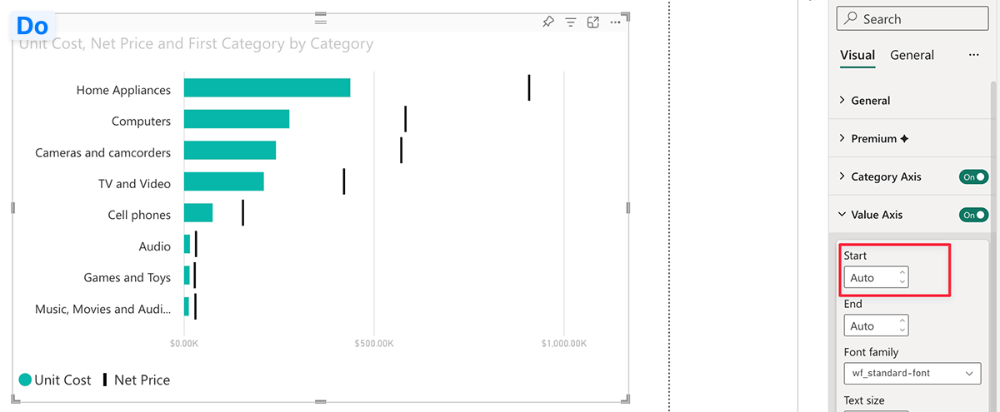
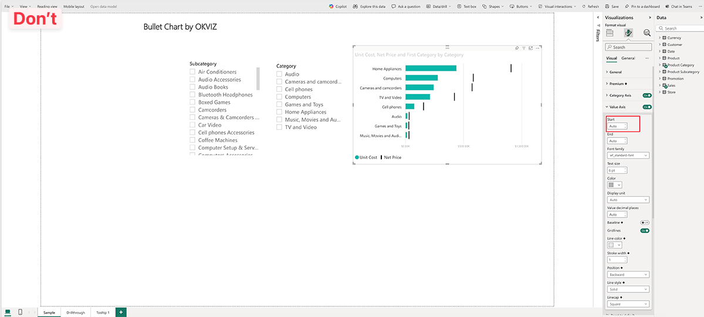
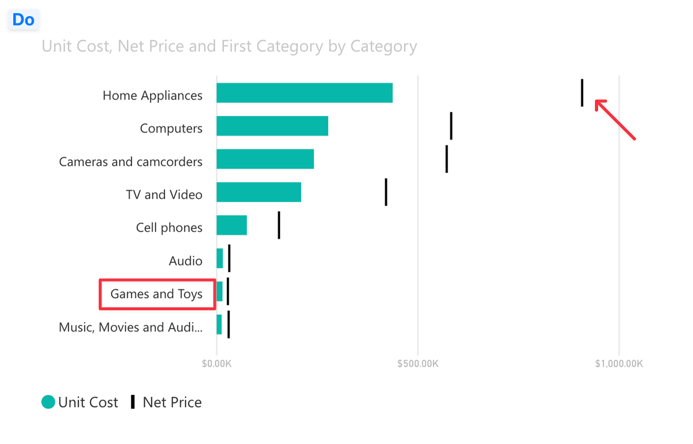
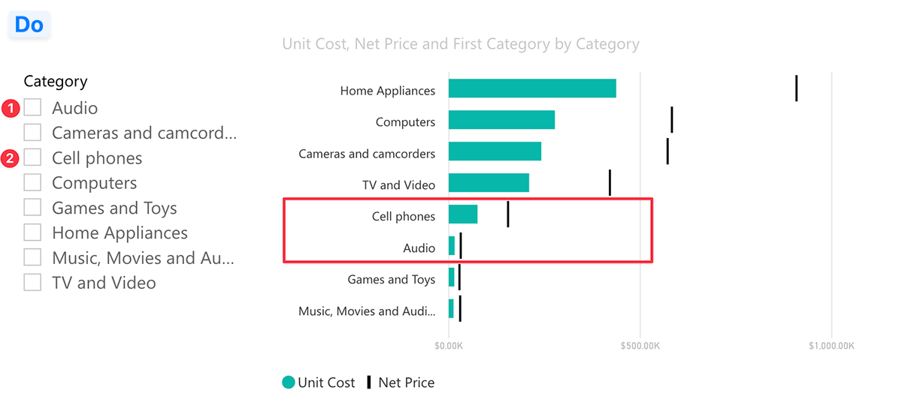
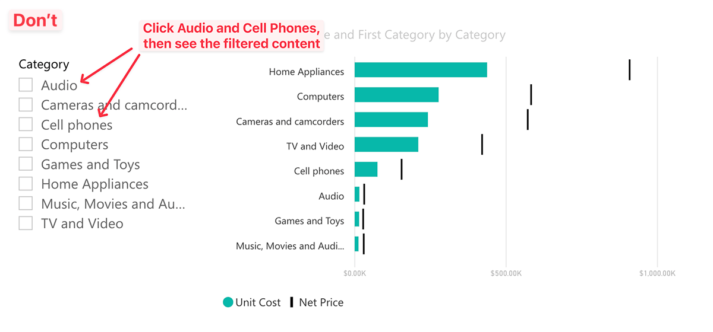

Follow these guidelines to ensure all screenshots included in OKVIZ content are high-quality, relevant, clear, and consistent.

## Quality Standards

- **Use High-Quality Images:**  
   When preparing screenshots, it’s essential to consider high-resolution displays like Retina screens, where pixel density is higher than standard displays. To ensure images appear sharp on different screen types, follow these best practices:

   - **Image Resolution:**

      - For **2x displays**, such as Retina/High-DPI screens on many modern devices, the screenshot’s width should be twice the intended display size. For instance, if you want the image to appear at 600 pixels wide, the actual image should be 1200 pixels wide.
      - For **3x displays**, like some high-density mobile screens, the image should be three times the desired display width. So, a 600-pixel wide image should be saved at 1800 pixels wide.

   - **Minimum Width Recommendations:**  
   For general use, aim for a minimum width of 1200 pixels to ensure readability and clarity across various devices.

- **Choose the Right Format:**  
   Use PNG format for screenshots that include UI elements, such as buttons, icons, or text. For images with photos or complex graphics, use JPEG format.

- **Optimize Images:**  
   Compress images to reduce file size and improve loading times. Use tools like [tinypng.com](https://tinypng.com/) to optimize images without losing quality.

## Dos and Don’ts

These are some general guidelines to follow when capturing and editing screenshots:

- **Focus on Relevant Areas:**  
   Capture only the parts of the screen that are important. Avoid taking full-screen screenshots unless absolutely necessary. Zoom in to show details clearly if needed.

   
   

- **Make Content Readable:**  
   Ensure that text, icons, and other important elements in the screenshot are easy to read. Resize or adjust the content for maximum legibility.

- **Highlight Key Areas:**  
   When highlighting important sections, **use simple red rectangles or arrows.** Do not use elements with shadows, gradients, or other graphic effects to highlight areas. This will help draw attention to specific parts of the image. Please be consistent with the use of shapes and colors.

   

- **Avoid Text Annotations:**  
   Do not add text directly to the screenshot. Instead, use counters, arrows, or shapes to point out specific areas. If text is necessary, add it as captions below the image.

   
   

- **Do Not Add Borders:**  
   Avoid adding borders around the screenshot. The image should blend seamlessly with the content on the page.

## Suggested Tools for Taking Screenshots

To capture high-quality screenshots, consider using the following tools:

- **Windows:** [SnagIt](https://www.techsmith.com/snagit/)
- **Mac:** [Cleanshot X](https://cleanshot.com/)

> These are paid tools, but they offer advanced features for capturing, editing, and annotating screenshots. Free alternatives like the built-in **Snipping Tool** on Windows or the **Screenshot** app on Mac can also be used for basic screenshot needs.