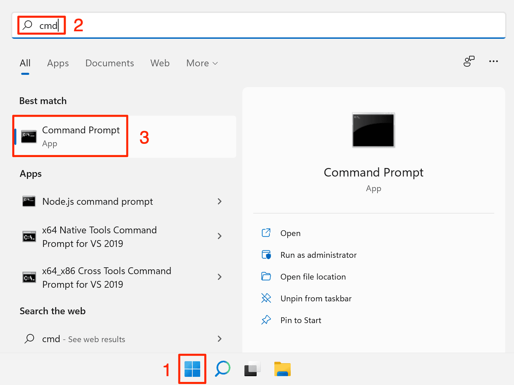
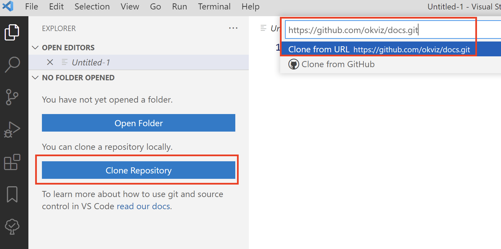
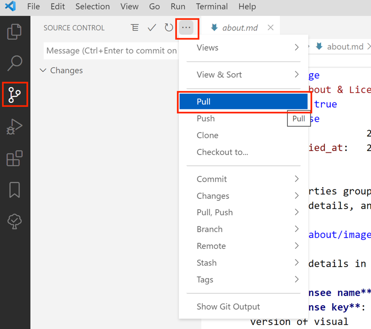
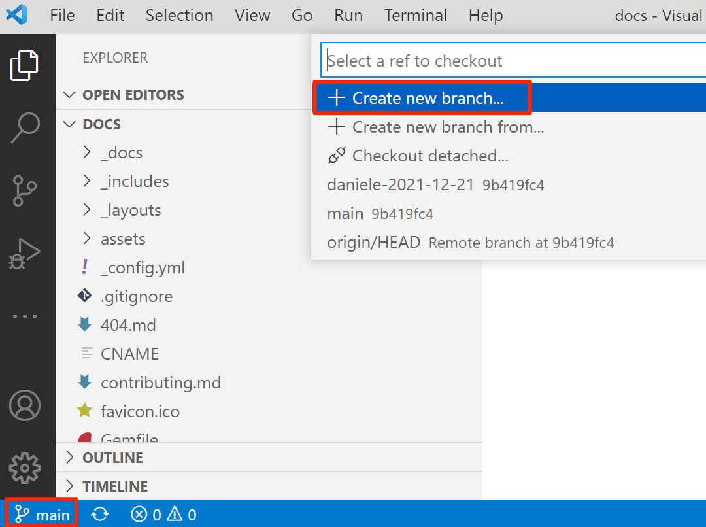

This document explains the workflow for editing the OKVIZ documentation (**docs**). Note that:
- The files consisting of the docs are hosted on Github at this URL (**repo**):
    <https://github.com/okviz/docs>  
- We use Github to edit, review and manage documents, but despite the repo being publicly accessible, end users will browse the docs at this URL (**website**):
    <https://docs.okviz.com>

For more information on Github, [check out this video](https://www.youtube.com/watch?v=w3jLJU7DT5E)

## Workflow

To edit the docs you need to follow the steps below:

- **Create a Github Account:**  
    You can create a Github account at this URL: <https://github.com/join>  
    Follow the on-screen directions, activate your account, then provide us your username, so we can invite you as a repo collaborator.

- **Setup** (steps to follow once):
    1. [Install Git](#install-git)
    2. [Install VSCode](#install-vscode)
    3. [Clone the Repo](#clone-the-repo)  

- **Make Changes** (steps to follow on every session):
    1. [Synchronize your Local Copy](#synchronize-your-local-copy)
    2. [Create a Branch](#create-a-branch)
    3. [Make your Changes](#make-your-changes)
    4. [Commit your Changes](#commit-your-changes)
    5. [Create a Pull Request](#create-a-pull-request)  

- **Approve Changes** (for reviewers only):
    1. [Review the Pull Request](#review-the-pull-request)  
    2. [Delete the Branch](#delete-the-branch)

### Setup

You need to follow the steps below only the first time.
1. #### Install Git

    Download Git from <https://git-scm.com/> and install it using the default options.

    After installing it, you need to configure your Github account – to do that:

    1. Open Command Prompt (or Terminal on Mac).
        The easiest way to do that is from search tool in the ***Start*** menu - search for ***cmd*** and click on the first result.
        
        

    2. At the command prompt, enter the following commands (replace ***your-email@domain.com*** and ***your-username*** with the ones you registered on Github): 
        - `git config --global user.email "your-email@domain.com"` (press Enter)
        - `git config --global user.name "your-username"` (press Enter)

        
    
2. #### Install VSCode

    While it is possible to edit repo documents directly through the Github website, it's easier to use a desktop tool such as Visual Studio Code (**VSCode**). 

    Download VSCode from <https://code.visualstudio.com/> and install it.

3. #### Clone the Repo

    Cloning a repository means creating a local copy of a remote repository on your computer. You can make any changes on your local copy and then, send those changes back online through a **Commit**.

    To clone the repo, open VSCode, click on the ***Clone Repository*** button in the ***Editors*** sidebar, and insert this repository URL: `https://github.com/okviz/docs.git`

    

    After inserting the URL, you are asked to choose a folder on your computer to store the content of the copy of the repo. Create a new one called ***OKVIZ*** and press ***Select Repository Location***. 

    At this point, VSCode downloads all the content from the repo online to your local folder and you're ready to start.  
    Proceed by opening the folder and trusting the authors.

### Make Changes

You have to follow the steps below every time you want to make some changes to the docs in a session. 
A session starts with synchronization and ends with a Pull Request.

1. #### Synchronize your Local Copy

    The first thing to do is to synchronize your local version of the repo with the version online, to include any changes made by the other contributors.

    In VSCode, click on the source control icon, select the ellipsis button, and choose the ***Pull*** command from the context menu. 

    

2. #### Create a Branch

    Now that you have the latest content on your computer, you need to create a new branch.  
    All documents accessible by the end users on the website are stored in the ***main*** branch of the repo, to make the review of your changes easier you need to copy this branch into a new one.

    Treat this new branch like a patch - a group of changes you want to apply to the ***main*** branch at the end of the current session.  

    > After the end of the session, **you will no longer use this branch**.

    To create a new branch, click on the label ***main*** on the lower-left corner of the VSCode window. Then click ***Create new branch...***, and enter a name in the format `username-YYYY-MM-DD` (replace ***username*** with your Github username and ***YYYY-MM-DD*** with the current date in ISO 8601 format).

    

3. #### Make your Changes

    At this point, you are working on a different branch (you see the name of the branch you have just created in the lower-left corner of the VSCode window - if the name is still ***main***, click on the name and select the correct one).

    

    The only place containing documents you may want to change is the **_docs** directory:

        _docs
            general 
            smart-filter-pro
            calendar-pro
            [any-other-visual-name]
       

    > **IMPORTANT**: Don't change any files outside of the ***_docs*** directory.

    The files in the _docs directory are written in Markdown (file extension ***.md***) which is a simplified version of HTML - see the [Markdown Syntax](#markdown-syntax) section for more information.  

    You can create files or folders directly in VSCode by right-clicking on the sidebar and choosing the appropriate command, and you can edit a file by left clicking on it in the sidebar. 
    
    Editing a Markdown file is easier if you also open the preview pane via the preview button - any changes in Markdown are interpreted and displayed in the preview pane in real time.

    

    After editing the files, save them and you are ready for the next steps.

4. #### Commit your Changes

    Committing a change means sending the files you changed locally back to the online repo. In fact, before committing, all changes are stored only in your local computer.

    To commit with VSCode, click on the ***Source Control*** icon, add a small description of the changes made in the input box above the ***Changes*** section, click the ellipsis button and choose Commit (or CTRL + Enter).

    

    Then click ***Publish Branch***.

    

    > The first time you commit something, VSCode needs to be authorized to access your Github account. Click on **Sign in with your browser** on the dialog box that appears, and follow the on-screen instructions to proceed.  
    > 

    

5. #### Create a Pull Request

    At this point your changes are online on another branch, not visible on the website. You want to make them available to everyone, but you can't commit them directly to the ***main*** branch because every change requires approval. To request approval, you need to create a Pull Request (**PR**).

    First of all, go to the repo on Github (<https://github.com/okviz/docs>), ***Sign in*** if you are not logged in, then click on ***Compare & pull request*** button that should appear on top of the files list.
    
    

    On the next page you can add more details to the request you are making and you can review all the changes you made. Also, note the top bar with the merge information - you are asking to merge you patch branch to the main branch.

    

    If everything looks fine, press the ***Create pull request*** button.

   

   At this point, the repo owner and the collaborator will be notified and may decide to approve your changes,  request more details, or discard the PR.

    *You are done, congratulations!*

### Approve Changes

These steps are for reviewers only. They must review the Pull Request, approve it, and delete the patch branch created by the contributor.

1. #### Review the Pull Request

    <todo>TODO</todo>

2. #### Delete the Branch

    <todo>TODO</todo>

## Markdown Syntax
 
Markdown documents (file extension ***.md***) are simple text files with additional special syntax that you can use to style your content, embed images, or create links.  
These documents are interpreted, this means that **what you write is not exactly what will appear** on the website, for this reason it is recommended to use the VSCode preview pane to see the final result while editing.

<todo>TODO</todo>

## Best Practices

Follow these best practices to make the docs clean and consistent.

<todo>TODO</todo>